# 🏛️ Ultimate System Design & Design Patterns Guide (C++)

This repository is a comprehensive reference for **Object-Oriented Programming (OOP)**, **SOLID Principles**, and **Design Patterns**, featuring exact C++ implementations and detailed UML diagrams.

---

## 📑 Table of Contents
1. [🧩 OOP Pillars](#1-oop-pillars)
2. [🎯 SOLID Design Principles](#2-solid-design-principles)
3. [🏗️ Creational Patterns](#3-creational-patterns)
4. [🧱 Structural Patterns](#4-structural-patterns)
5. [🔄 Behavioral Patterns](#5-behavioral-patterns)
6. [🍔 Case Study: Food Delivery Application](#6-case-study-food-delivery-application)

---

## 1. 🧩 OOP Pillars

### 🧱 Encapsulation
*   **Description:** Bundling data and methods into a single unit (class) and restricting access using `private`/`protected` keywords.
*   **Why use it?:** To protect internal state and reduce complexity by hiding details.

### 🔍 Abstraction
*   **Description:** Hiding complex implementation details and showing only essential features (interfaces/abstract classes).
*   **Why use it?:** To decouple "what" an object does from "how" it does it.

### 🧬 Inheritance
*   **Description:** Allowing a class to derive attributes and behaviors from another class.
*   **Why use it?:** For code reusability and establishing "is-a" relationships.

### 🎭 Polymorphism
*   **Description:** The ability of different classes to respond to the same function call (Compile-time via overloading, Runtime via virtual functions).
*   **Why use it?:** To write generic code that works with different types of objects.

---

## 2. 🎯 SOLID Design Principles

### 1. Single Responsibility Principle (SRP)
*   **Description:** A class should have only one reason to change.
*   **Advantages:** Better maintainability and testability.
*   **Use Cases:** Separating UI logic from business logic.
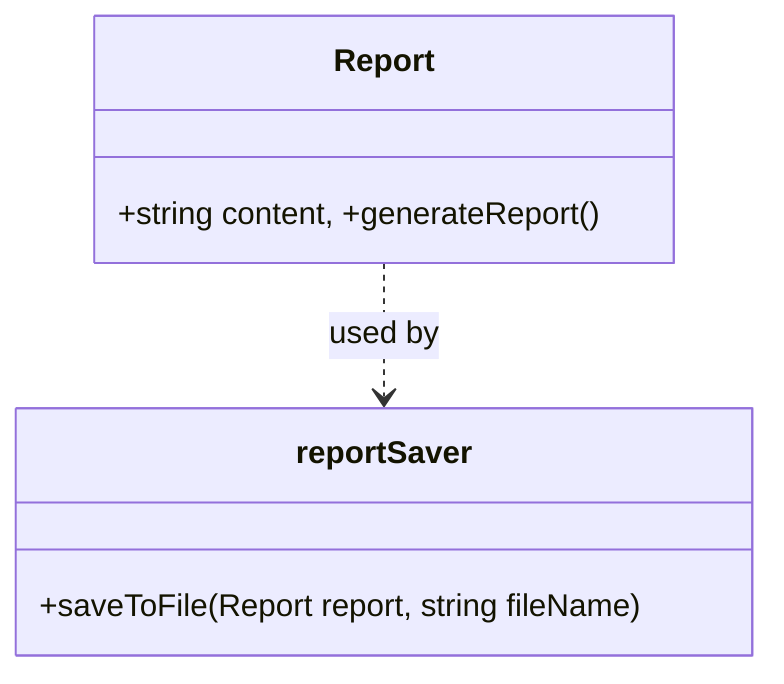

### 2. Open/Closed Principle (OCP)
*   **Description:** Open for extension, closed for modification.
*   **Why use it?:** To add features without breaking existing code.
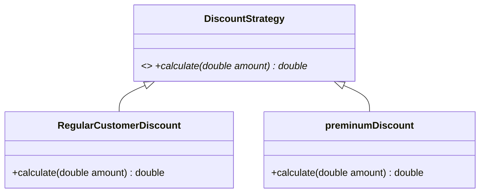

### 3. Liskov Substitution Principle (LSP)
*   **Description:** Subclasses must be substitutable for their base classes.
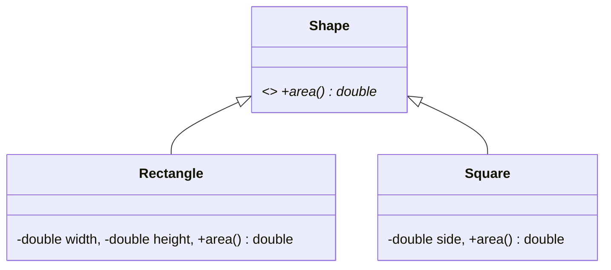

### 4. Interface Segregation Principle (ISP)
*   **Description:** Clients shouldn't be forced to depend on methods they don't use.
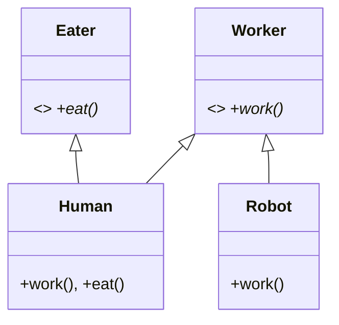

### 5. Dependency Inversion Principle (DIP)
*   **Description:** Depend on abstractions, not concretions.
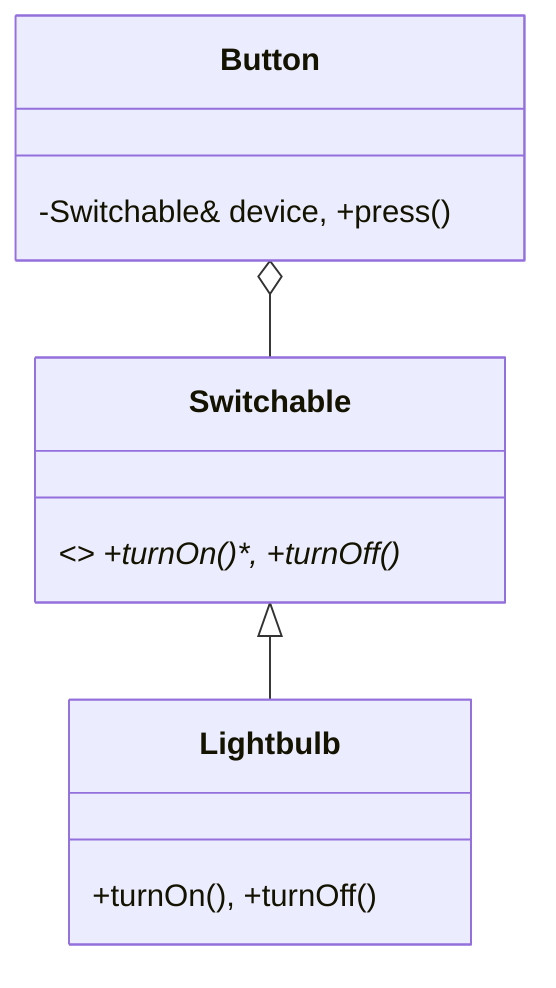

---

## 3. 🏗️ Creational Patterns

### 🏭 Factory (Simple, Method, and Abstract)
*   **Description:** Defines an interface for creating objects but lets subclasses decide which class to instantiate.
*   **Advantages:** Decouples client from concrete classes.
*   **Disadvantages:** Complexity increases with more subclasses.
*   **UML (Abstract Factory):**
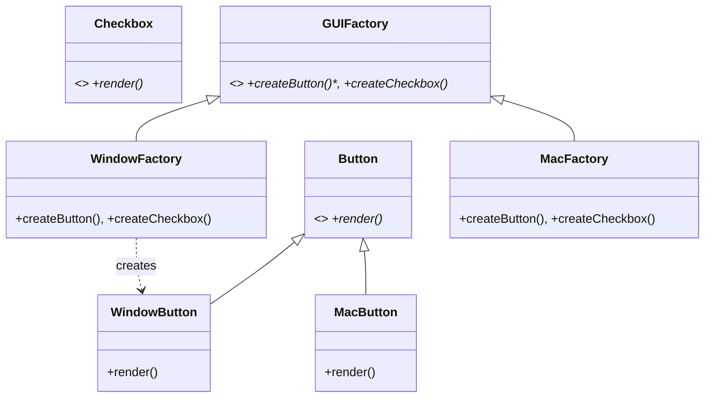

### 👷 Builder
*   **Description:** Constructs complex objects step-by-step.
*   **Why use it?:** To avoid "telescoping constructors" and create different representations.
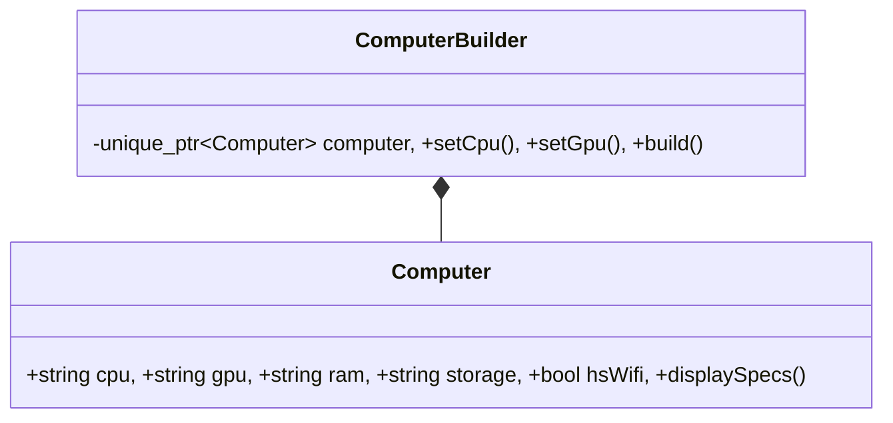

### 👑 Singleton
*   **Description:** Ensures only one instance of a class exists globally.
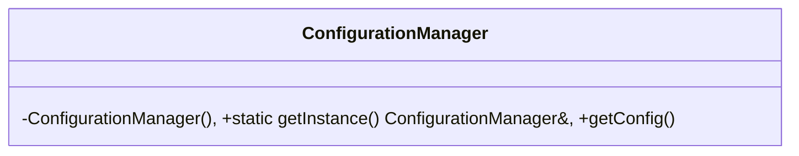

---

## 4. 🧱 Structural Patterns

### 🔌 Adapter
*   **Description:** Converts one interface into another that a client expects.
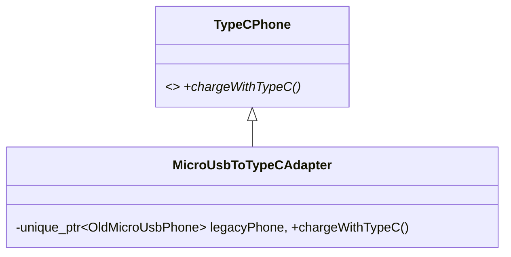

### 🌉 Bridge
*   **Description:** Decouples abstraction from implementation so both can vary independently.
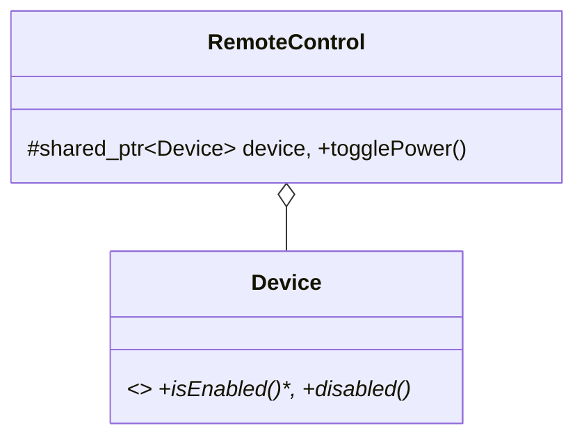

### 🌳 Composite
*   **Description:** Treats individual objects and compositions of objects uniformly.
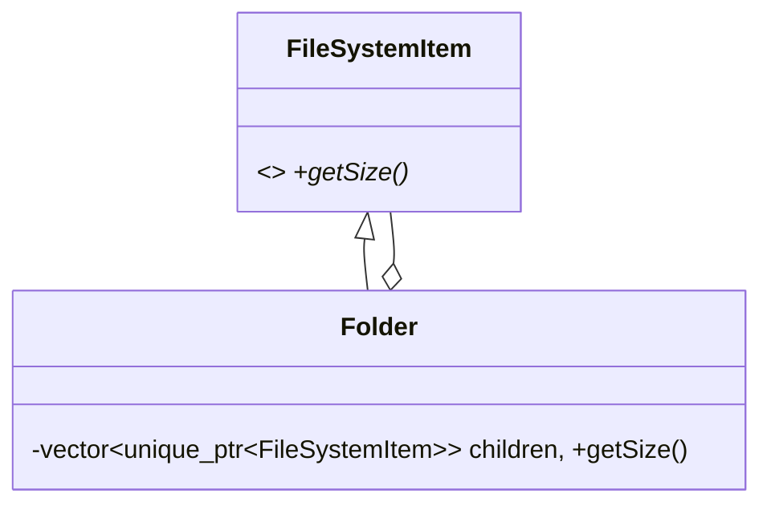

### 🧣 Decorator
*   **Description:** Dynamically adds behavior to an object without changing its class.
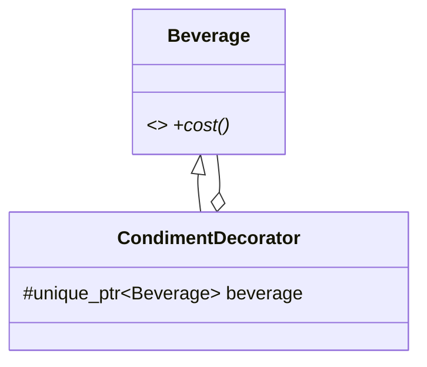

### 🏛️ Facade
*   **Description:** Provides a simplified interface to a complex subsystem.
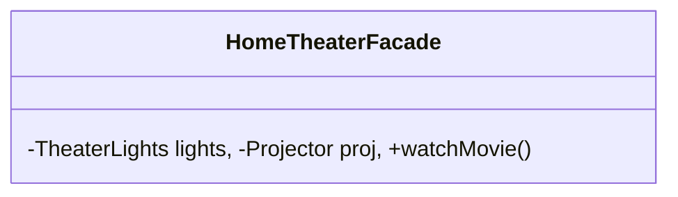

### 🪶 Flyweight
*   **Description:** Minimizes memory usage by sharing as much data as possible with similar objects.
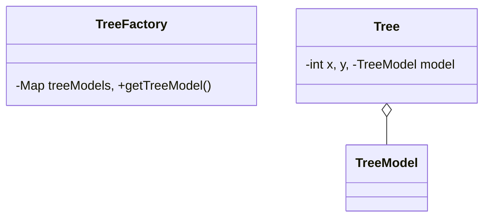

### 🛡️ Proxy
*   **Description:** Provides a placeholder for another object to control access.
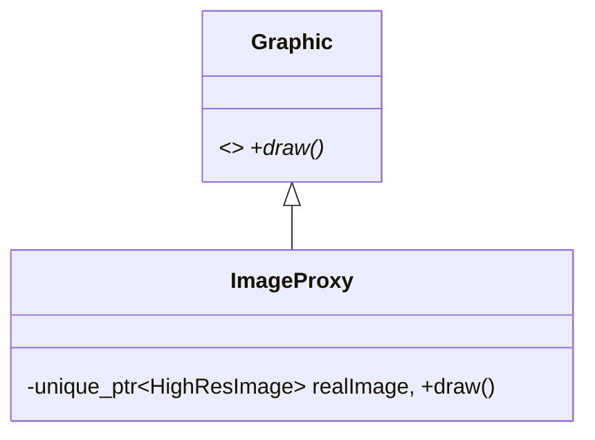

---

## 5. 🔄 Behavioral Patterns

### 🔗 Chain of Responsibility
*   **Description:** Passes a request along a chain of potential handlers.
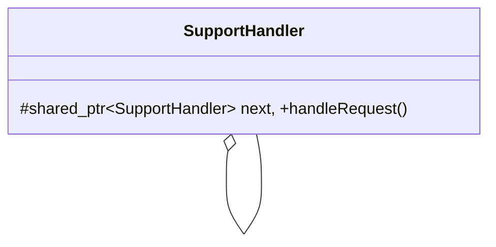

### 📜 Command
*   **Description:** Encapsulates a request as an object, allowing parameterization and undo/redo.
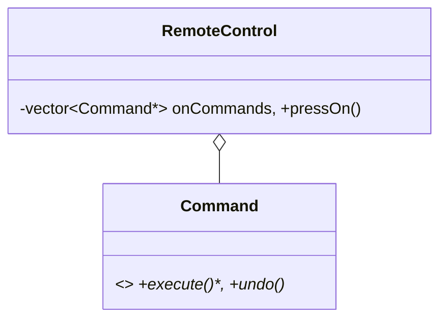

### 📑 Iterator
*   **Description:** Provides a way to access elements of a collection sequentially without exposing its underlying structure.
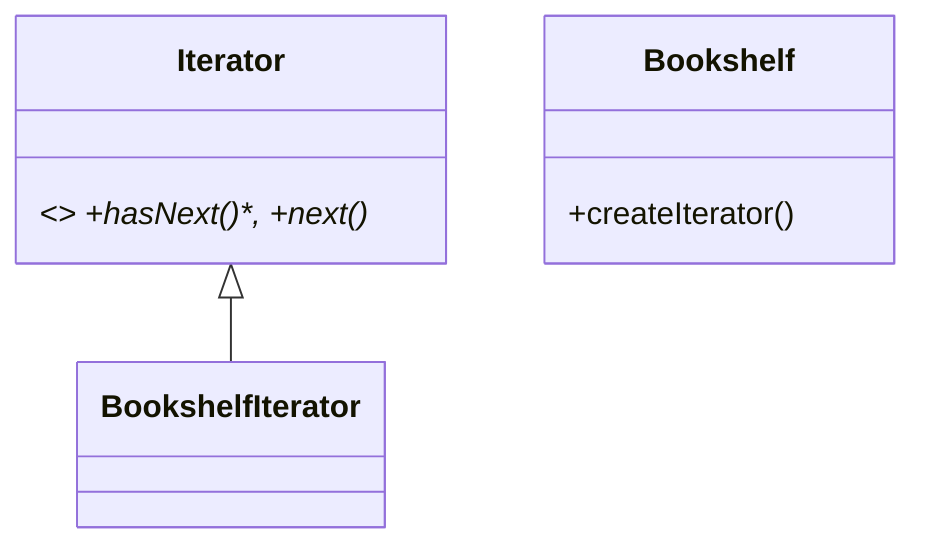

### 🔔 Observer
*   **Description:** One-to-many dependency where state changes notify all dependents.
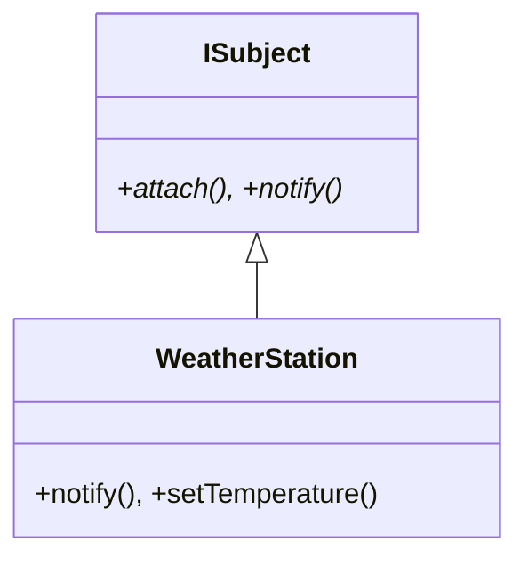

### 🎯 Strategy
*   **Description:** Defines a family of algorithms and makes them interchangeable at runtime.
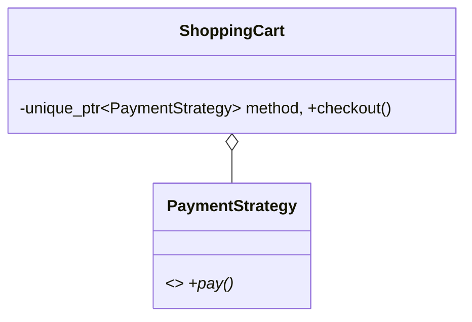

### 📋 Template Method
*   **Description:** Defines the skeleton of an algorithm in a base class, deferring some steps to subclasses.
```mermaid
classDiagram
    class DocumentParser { +processDocument(), #extractRawText()* }
```

---

## 6. 🍔 Case Study: Food Delivery Application

### Detailed System UML Diagram
```mermaid
classDiagram
    class FoodDeliverySystem {
        -RestaurantManager* restaurantManager
        -OrderManager* orderManager
        -OrderFactory* orderFactory
        +placeOrder()
    }
    class Order { <<abstract>> #User* user, #Restaurant* restaurant, +processPayment() }
    class User { -Cart* cart }
    class OrderFactory { <<interface>> +createOrder()* }
    
    FoodDeliverySystem --> OrderManager
    FoodDeliverySystem --> OrderFactory
    Order <|-- DeliveryOrder
    Order <|-- PickupOrder
    User *-- Cart
    Order o-- PaymentStrategy
```

---
*Developed for educational purposes in C++.*
