# 🏛️ Ultimate System Design & Design Patterns Guide (C++)

This repository provides a deep dive into **SOLID Principles** and **Design Patterns**, with exact C++ implementations and detailed UML diagrams.

---

## 🎯 SOLID Design Principles

### 1. Single Responsibility Principle (SRP)
*   **Good Implementation (from solidPrinciple.cpp)**
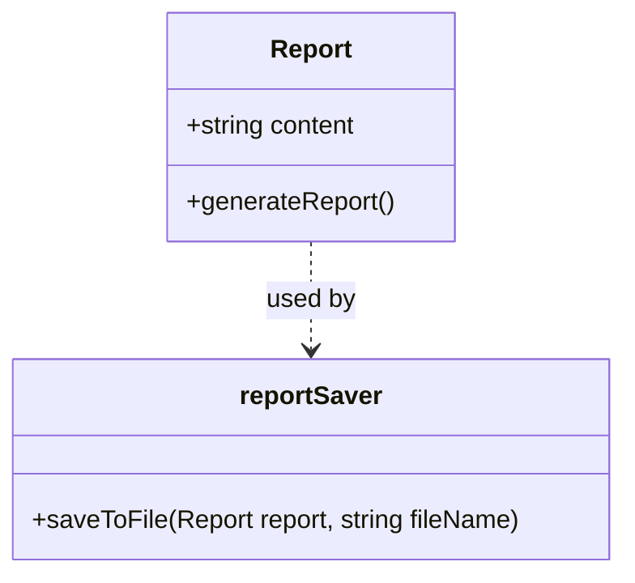
```mermaid
classDiagram
    class Report {
        +string content
        +generateReport()
    }
    class reportSaver {
        +saveToFile(Report report, string fileName)
    }
    Report ..> reportSaver : used by
```

### 2. Open/Closed Principle (OCP)
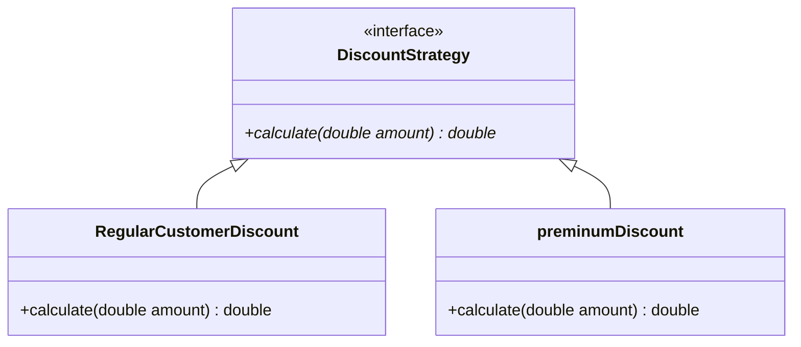
```mermaid
classDiagram
    class DiscountStrategy {
        <<interface>>
        +calculate(double amount)* double
    }
    class RegularCustomerDiscount {
        +calculate(double amount) double
    }
    class preminumDiscount {
        +calculate(double amount) double
    }
    DiscountStrategy <|-- RegularCustomerDiscount
    DiscountStrategy <|-- preminumDiscount
```

### 3. Liskov Substitution Principle (LSP)
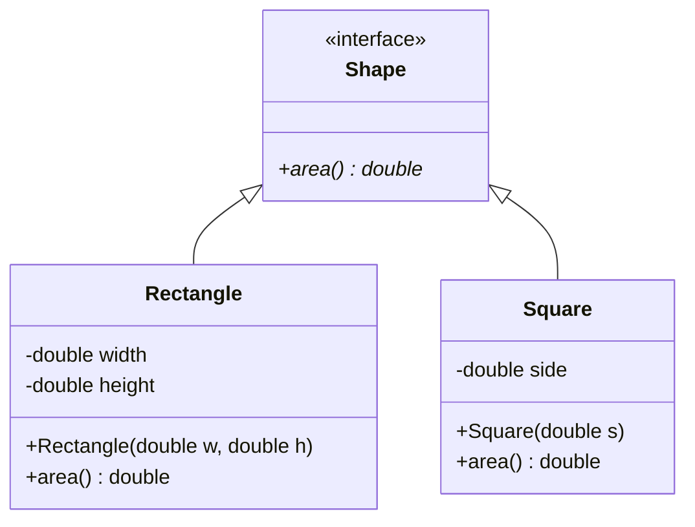
```mermaid
classDiagram
    class Shape {
        <<interface>>
        +area()* double
    }
    class Rectangle {
        -double width
        -double height
        +Rectangle(double w, double h)
        +area() double
    }
    class Square {
        -double side
        +Square(double s)
        +area() double
    }
    Shape <|-- Rectangle
    Shape <|-- Square
```

### 4. Interface Segregation Principle (ISP)
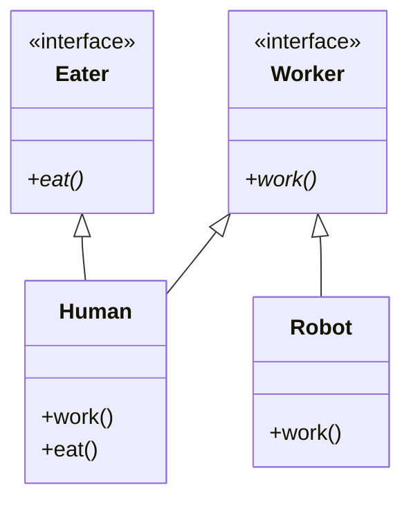
```mermaid
classDiagram
    class Worker {
        <<interface>>
        +work()*
    }
    class Eater {
        <<interface>>
        +eat()*
    }
    class Human {
        +work()
        +eat()
    }
    class Robot {
        +work()
    }
    Worker <|-- Human
    Eater <|-- Human
    Worker <|-- Robot
```

### 5. Dependency Inversion Principle (DIP)
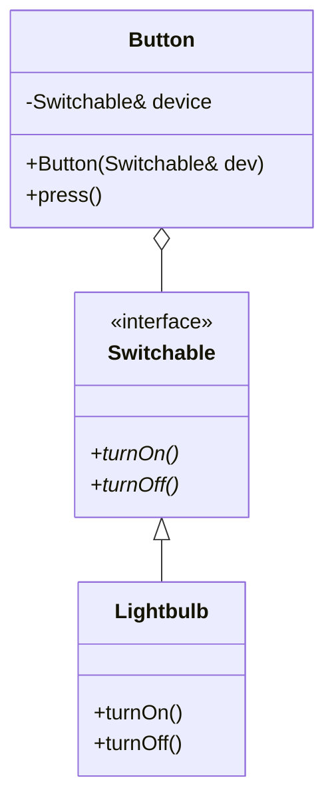
```mermaid
classDiagram
    class Switchable {
        <<interface>>
        +turnOn()*
        +turnOff()*
    }
    class Lightbulb {
        +turnOn()
        +turnOff()
    }
    class Button {
        -Switchable& device
        +Button(Switchable& dev)
        +press()
    }
    Switchable <|-- Lightbulb
    Button o-- Switchable
```

---

## 🏗️ Creational Patterns

### 🏭 Factory Method & Abstract Factory
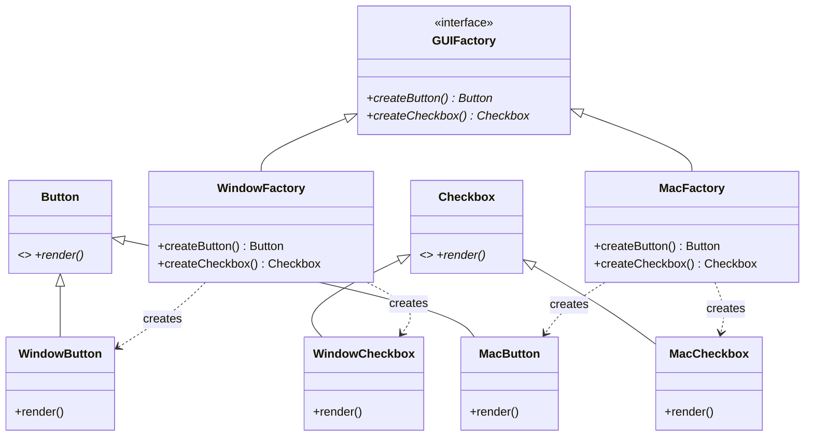
```mermaid
classDiagram
    class Button { <<interface>> +render()* }
    class Checkbox { <<interface>> +render()* }
    class WindowButton { +render() }
    class MacButton { +render() }
    class WindowCheckbox { +render() }
    class MacCheckbox { +render() }
    
    class GUIFactory {
        <<interface>>
        +createButton()* Button
        +createCheckbox()* Checkbox
    }
    class WindowFactory {
        +createButton() Button
        +createCheckbox() Checkbox
    }
    class MacFactory {
        +createButton() Button
        +createCheckbox() Checkbox
    }

    Button <|-- WindowButton
    Button <|-- MacButton
    Checkbox <|-- WindowCheckbox
    Checkbox <|-- MacCheckbox
    GUIFactory <|-- WindowFactory
    GUIFactory <|-- MacFactory
    WindowFactory ..> WindowButton : creates
    WindowFactory ..> WindowCheckbox : creates
    MacFactory ..> MacButton : creates
    MacFactory ..> MacCheckbox : creates
```

### 👷 Builder
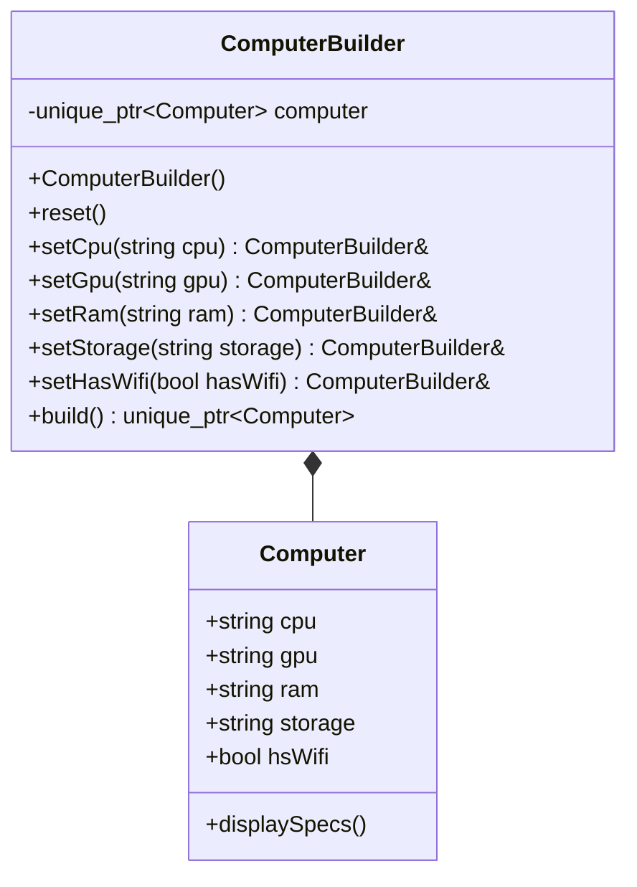
```mermaid
classDiagram
    class Computer {
        +string cpu
        +string gpu
        +string ram
        +string storage
        +bool hsWifi
        +displaySpecs()
    }
    class ComputerBuilder {
        -unique_ptr~Computer~ computer
        +ComputerBuilder()
        +reset()
        +setCpu(string cpu) ComputerBuilder&
        +setGpu(string gpu) ComputerBuilder&
        +setRam(string ram) ComputerBuilder&
        +setStorage(string storage) ComputerBuilder&
        +setHasWifi(bool hasWifi) ComputerBuilder&
        +build() unique_ptr~Computer~
    }
    ComputerBuilder *-- Computer
```

### 👑 Singleton
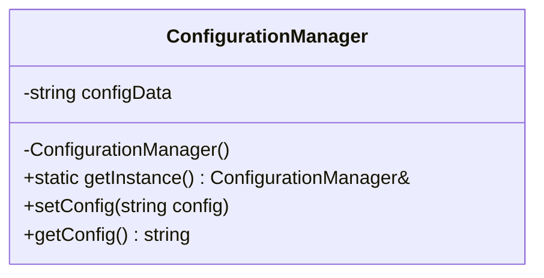
```mermaid
classDiagram
    class ConfigurationManager {
        -string configData
        -ConfigurationManager()
        +static getInstance() ConfigurationManager&
        +setConfig(string config)
        +getConfig() string
    }
```

---

## 🧱 Structural Patterns

### 🔌 Adapter
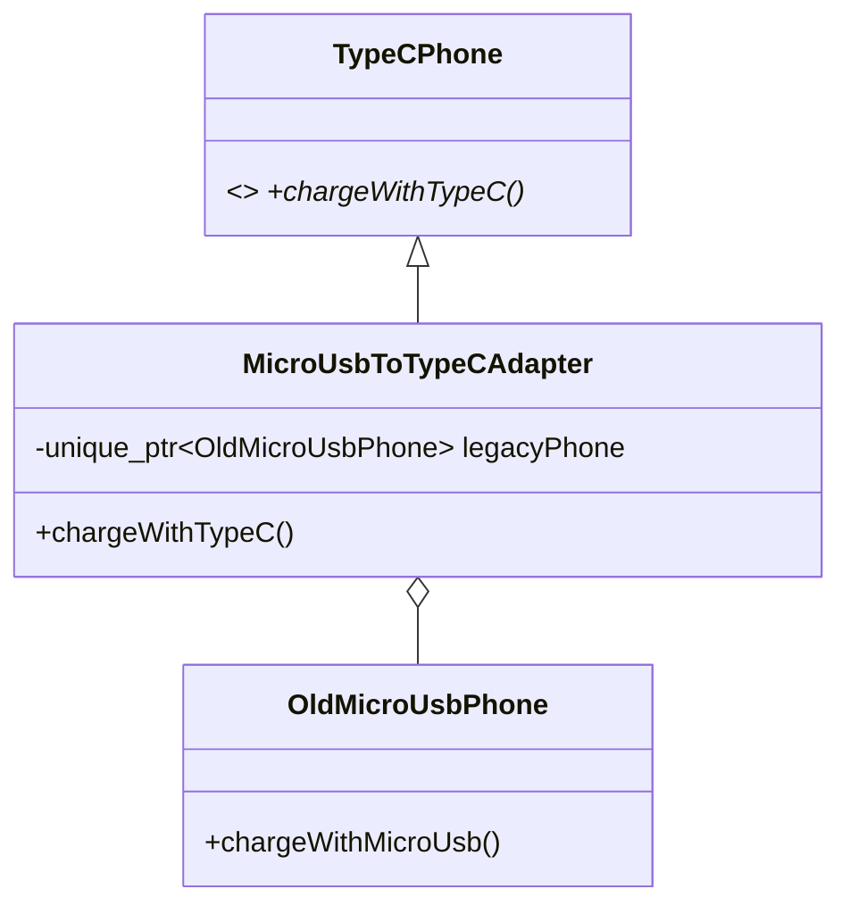
```mermaid
classDiagram
    class TypeCPhone { <<interface>> +chargeWithTypeC()* }
    class OldMicroUsbPhone { +chargeWithMicroUsb() }
    class MicroUsbToTypeCAdapter {
        -unique_ptr~OldMicroUsbPhone~ legacyPhone
        +chargeWithTypeC()
    }
    TypeCPhone <|-- MicroUsbToTypeCAdapter
    MicroUsbToTypeCAdapter o-- OldMicroUsbPhone
```

### 🌉 Bridge
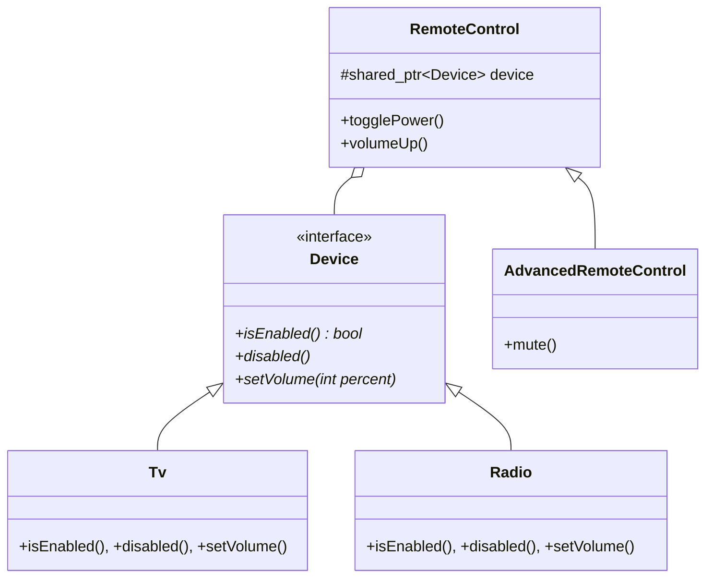
```mermaid
classDiagram
    class Device {
        <<interface>>
        +isEnabled()* bool
        +disabled()*
        +setVolume(int percent)*
    }
    class Tv { +isEnabled(), +disabled(), +setVolume() }
    class Radio { +isEnabled(), +disabled(), +setVolume() }
    class RemoteControl {
        #shared_ptr~Device~ device
        +togglePower()
        +volumeUp()
    }
    class AdvancedRemoteControl { +mute() }
    
    Device <|-- Tv
    Device <|-- Radio
    RemoteControl o-- Device
    RemoteControl <|-- AdvancedRemoteControl
```

### 🌳 Composite
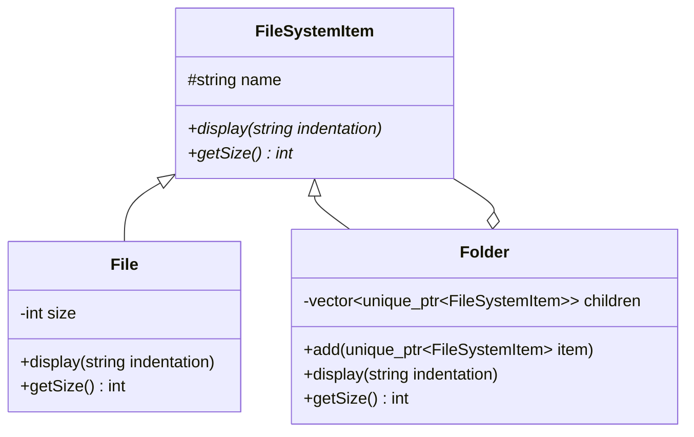
```mermaid
classDiagram
    class FileSystemItem {
        #string name
        +display(string indentation)*
        +getSize()* int
    }
    class File {
        -int size
        +display(string indentation)
        +getSize() int
    }
    class Folder {
        -vector~unique_ptr~FileSystemItem~~ children
        +add(unique_ptr~FileSystemItem~ item)
        +display(string indentation)
        +getSize() int
    }
    FileSystemItem <|-- File
    FileSystemItem <|-- Folder
    Folder o-- FileSystemItem
```

### 🧣 Decorator
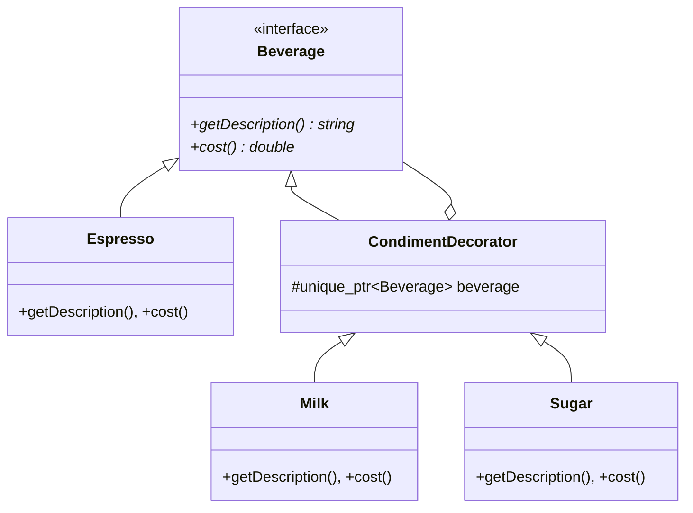
```mermaid
classDiagram
    class Beverage {
        <<interface>>
        +getDescription()* string
        +cost()* double
    }
    class Espresso { +getDescription(), +cost() }
    class CondimentDecorator {
        #unique_ptr~Beverage~ beverage
    }
    class Milk { +getDescription(), +cost() }
    class Sugar { +getDescription(), +cost() }

    Beverage <|-- Espresso
    Beverage <|-- CondimentDecorator
    CondimentDecorator <|-- Milk
    CondimentDecorator <|-- Sugar
    CondimentDecorator o-- Beverage
```

### 🏛️ Facade
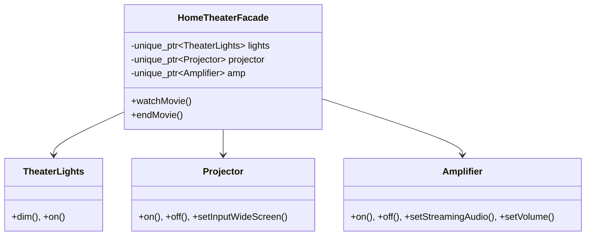
```mermaid
classDiagram
    class HomeTheaterFacade {
        -unique_ptr~TheaterLights~ lights
        -unique_ptr~Projector~ projector
        -unique_ptr~Amplifier~ amp
        +watchMovie()
        +endMovie()
    }
    class TheaterLights { +dim(), +on() }
    class Projector { +on(), +off(), +setInputWideScreen() }
    class Amplifier { +on(), +off(), +setStreamingAudio(), +setVolume() }

    HomeTheaterFacade --> TheaterLights
    HomeTheaterFacade --> Projector
    HomeTheaterFacade --> Amplifier
```

### 🪶 Flyweight
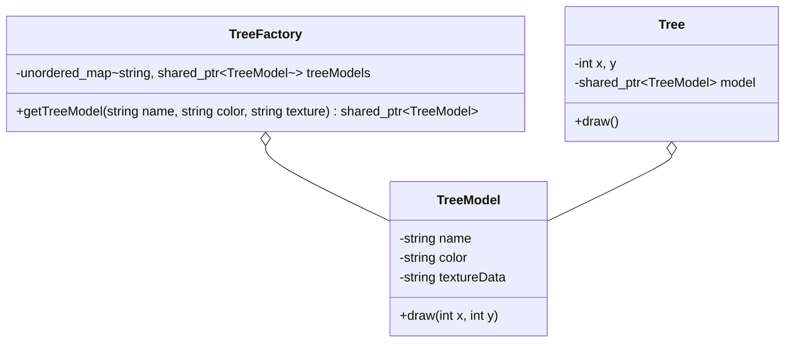
```mermaid
classDiagram
    class TreeModel {
        -string name
        -string color
        -string textureData
        +draw(int x, int y)
    }
    class TreeFactory {
        -unordered_map~string, shared_ptr~TreeModel~~ treeModels
        +getTreeModel(string name, string color, string texture) shared_ptr~TreeModel~
    }
    class Tree {
        -int x, y
        -shared_ptr~TreeModel~ model
        +draw()
    }
    TreeFactory o-- TreeModel
    Tree o-- TreeModel
```

### 🛡️ Proxy
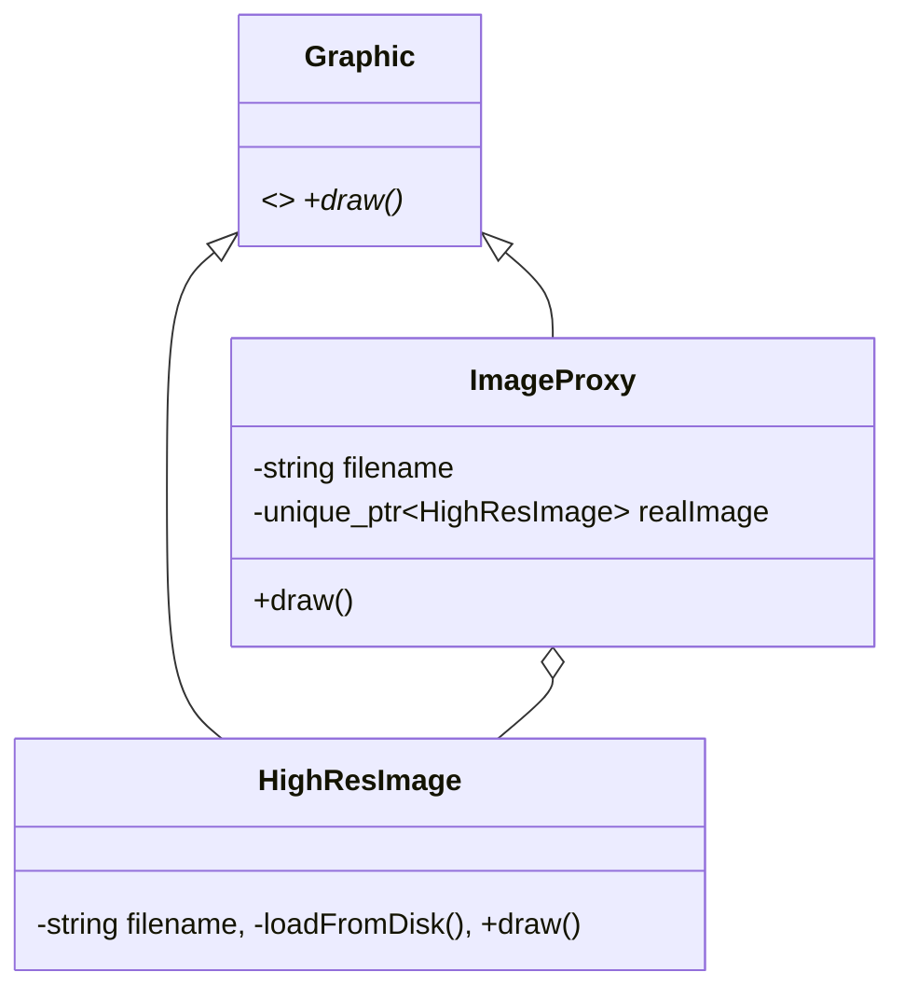
```mermaid
classDiagram
    class Graphic { <<interface>> +draw()* }
    class HighResImage { -string filename, -loadFromDisk(), +draw() }
    class ImageProxy {
        -string filename
        -unique_ptr~HighResImage~ realImage
        +draw()
    }
    Graphic <|-- HighResImage
    Graphic <|-- ImageProxy
    ImageProxy o-- HighResImage
```

---

## 🔄 Behavioral Patterns

### 🔗 Chain of Responsibility
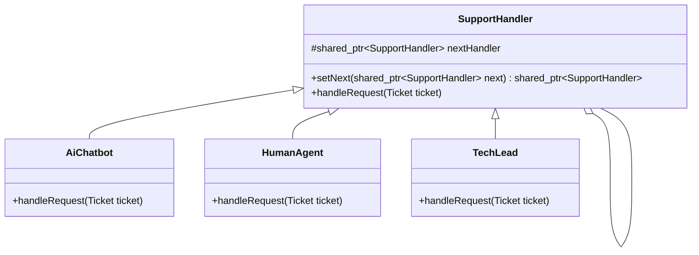
```mermaid
classDiagram
    class SupportHandler {
        #shared_ptr~SupportHandler~ nextHandler
        +setNext(shared_ptr~SupportHandler~ next) shared_ptr~SupportHandler~
        +handleRequest(Ticket ticket)
    }
    class AiChatbot { +handleRequest(Ticket ticket) }
    class HumanAgent { +handleRequest(Ticket ticket) }
    class TechLead { +handleRequest(Ticket ticket) }
    
    SupportHandler <|-- AiChatbot
    SupportHandler <|-- HumanAgent
    SupportHandler <|-- TechLead
    SupportHandler o-- SupportHandler
```

### 📜 Command
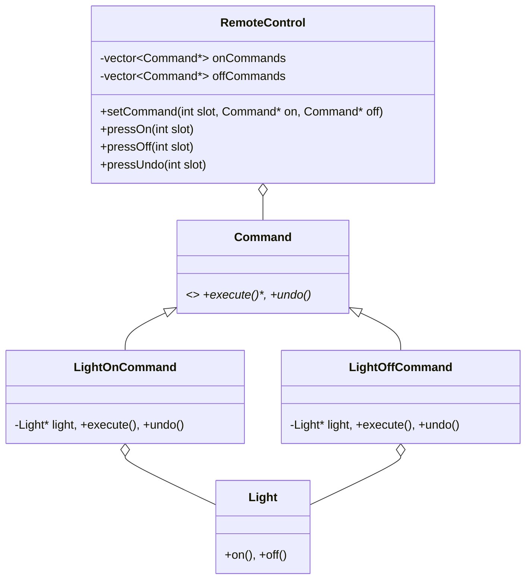
```mermaid
classDiagram
    class Command { <<interface>> +execute()*, +undo()* }
    class LightOnCommand { -Light* light, +execute(), +undo() }
    class LightOffCommand { -Light* light, +execute(), +undo() }
    class Light { +on(), +off() }
    class RemoteControl {
        -vector~Command*~ onCommands
        -vector~Command*~ offCommands
        +setCommand(int slot, Command* on, Command* off)
        +pressOn(int slot)
        +pressOff(int slot)
        +pressUndo(int slot)
    }
    Command <|-- LightOnCommand
    Command <|-- LightOffCommand
    LightOnCommand o-- Light
    LightOffCommand o-- Light
    RemoteControl o-- Command
```

### 📑 Iterator
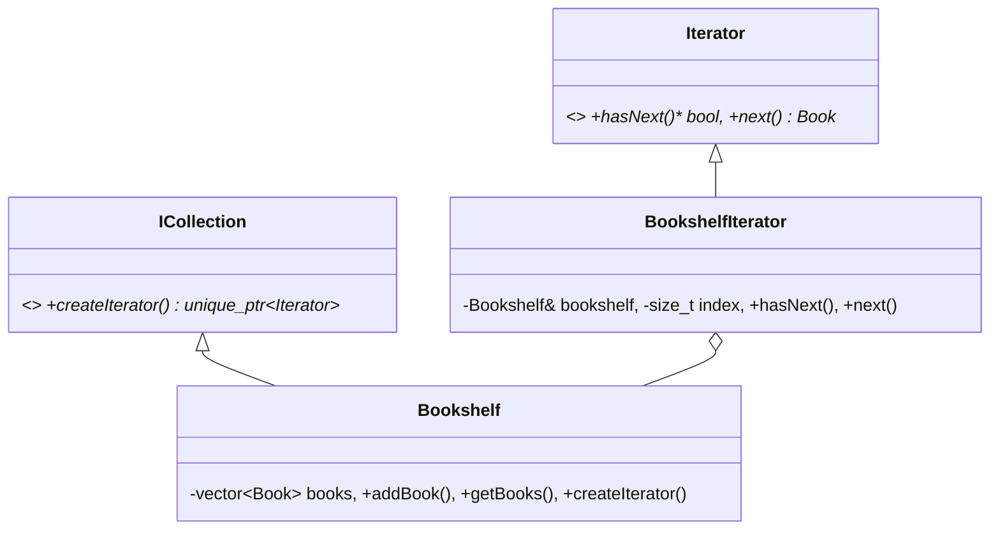
```mermaid
classDiagram
    class Iterator { <<interface>> +hasNext()* bool, +next()* Book }
    class ICollection { <<interface>> +createIterator()* unique_ptr~Iterator~ }
    class Bookshelf { -vector~Book~ books, +addBook(), +getBooks(), +createIterator() }
    class BookshelfIterator { -Bookshelf& bookshelf, -size_t index, +hasNext(), +next() }
    
    Iterator <|-- BookshelfIterator
    ICollection <|-- Bookshelf
    BookshelfIterator o-- Bookshelf
```

### 🔔 Observer
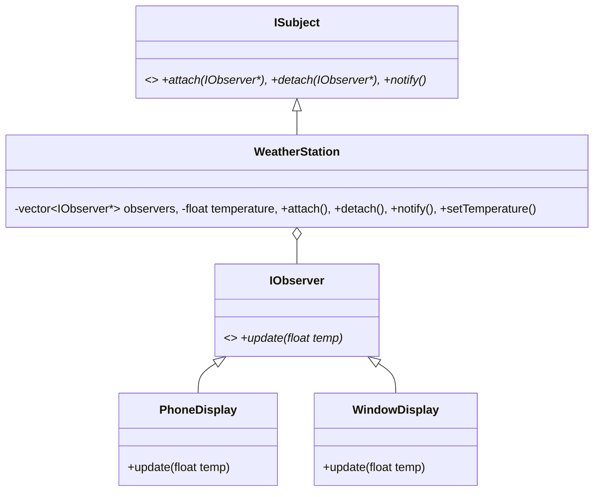
```mermaid
classDiagram
    class IObserver { <<interface>> +update(float temp)* }
    class ISubject { <<interface>> +attach(IObserver*), +detach(IObserver*), +notify()* }
    class WeatherStation { -vector~IObserver*~ observers, -float temperature, +attach(), +detach(), +notify(), +setTemperature() }
    class PhoneDisplay { +update(float temp) }
    class WindowDisplay { +update(float temp) }

    IObserver <|-- PhoneDisplay
    IObserver <|-- WindowDisplay
    ISubject <|-- WeatherStation
    WeatherStation o-- IObserver
```

### 🎯 Strategy
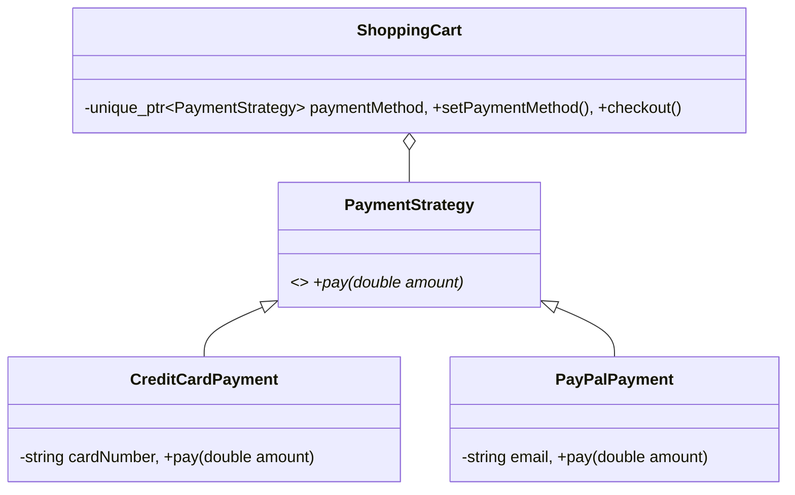
```mermaid
classDiagram
    class PaymentStrategy { <<interface>> +pay(double amount)* }
    class CreditCardPayment { -string cardNumber, +pay(double amount) }
    class PayPalPayment { -string email, +pay(double amount) }
    class ShoppingCart { -unique_ptr~PaymentStrategy~ paymentMethod, +setPaymentMethod(), +checkout() }

    PaymentStrategy <|-- CreditCardPayment
    PaymentStrategy <|-- PayPalPayment
    ShoppingCart o-- PaymentStrategy
```

### 📋 Template Method
```mermaid
classDiagram
    class DocumentParser {
        +processDocument(string filePath)
        #openFile(), #runAnalytics(), #closeFile()
        #extractRawText()*
        #hookSendNotification() bool
    }
    class PdfParser { #extractRawText(), #hookSendNotification() }
    class CsvParser { #extractRawText() }
    
    DocumentParser <|-- PdfParser
    DocumentParser <|-- CsvParser
```

---

## 🍔 Case Study: Food Delivery Application

### Detailed System UML Diagram
```mermaid
classDiagram
    class FoodDeliverySystem {
        -RestaurantManager* restaurantManager
        -OrderManager* orderManager
        -OrderFactory* orderFactory
        +FoodDeliverySystem()
        +~FoodDeliverySystem()
        +addRestaurant(Restaurant* r)
        +searchRestaurants(string location) vector~Restaurant*~
        +placeOrder(User* user, Restaurant* restaurant, PaymentStrategy* paymentMethod, string type) bool
        +showOrders()
    }

    class RestaurantManager {
        -vector~Restaurant*~ restaurants
        -static RestaurantManager* instance
        -RestaurantManager()
        +static getInstance() RestaurantManager*
        +addRestaurant(Restaurant* restaurant)
        +searchByLocation(string loc) vector~Restaurant*~
    }

    class OrderManager {
        -vector~Order*~ orders
        -static OrderManager* instance
        -OrderManager()
        +static getInstance() OrderManager*
        +addOrder(Order* order)
        +listOrders()
    }

    class OrderFactory {
        <<interface>>
        +createOrder(User* user, Cart* cart, Restaurant* restaurant, vector~MenuItem~ menuItems, PaymentStrategy* paymentStrategy, string orderType) Order*
    }

    class NowOrderFactory {
        +createOrder(User* user, Cart* cart, Restaurant* restaurant, vector~MenuItem~ menuItems, PaymentStrategy* paymentStrategy, string orderType) Order*
    }

    class Order {
        <<abstract>>
        #static int nextOrderId
        #int orderId
        #User* user
        #Restaurant* restaurant
        #vector~MenuItem~ items
        #PaymentStrategy* paymentStrategy
        #double total
        #string schedule
        #string status
        +Order()
        +virtual ~Order()
        +processPayment() bool
        +virtual getType() string*
        +getOrderId() int
        +setUser(User* u)
        +getUser() User*
        +setRestaurant(Restaurant* r)
        +getRestaurant() Restaurant*
        +setItems(vector~MenuItem~ items)
        +getItems() vector~MenuItem~
        +setPaymentStrategy(PaymentStrategy* strategy)
        +getStatus() string
        +setStatus(string s)
        +getTotalAmount() double
        +setTotal(double t)
        +setScheduled(string s)
        +getScheduled() string
    }

    class DeliveryOrder {
        -string userAddress
        +DeliveryOrder()
        +getType() string
        +setUserAddress(string address)
        +getUserAddress() string
    }

    class PickupOrder {
        -string restaurantAddress
        +PickupOrder()
        +getType() string
        +setRestaurantAddress(string address)
        +getRestaurantAddress() string
    }

    class User {
        -int userId
        -string name
        -string address
        -Cart* cart
        +User(int userId, string name, string address)
        +~User()
        +getName() string
        +getAddress() string
        +setaddress(string a)
        +getCart() Cart*
    }

    class Cart {
        -Restaurant* restaurant
        -vector~MenuItem~ items
        +Cart()
        +addItem(MenuItem item)
        +getTotalPrice() double
        +isEmpty() bool
        +clear()
        +setRestaurant(Restaurant* r)
        +getRestaurant() Restaurant*
        +getItems() vector~MenuItem~
    }

    class Restaurant {
        -static int nextRestaurantId
        -int restaurantId
        -string name
        -string location
        -vector~MenuItem~ menuItems
        +Restaurant(string name, string location)
        +~Restaurant()
        +getName() string
        +setName(string n)
        +getLocation() string
        +setLocation(string loc)
        +addMenuItem(MenuItem item)
        +getMenuItems() vector~MenuItem~
    }

    class MenuItem {
        -string code
        -string name
        -int price
        +MenuItem(string code, string name, int price)
        +getCode() string
        +setCode(string c)
        +getName() string
        +setName(string n)
        +getPrice() int
        +setPrice(int p)
    }

    class PaymentStrategy {
        <<interface>>
        +virtual ~PaymentStrategy()
        +virtual pay(double amount)*
    }

    class CreditCardPaymentStrategy {
        -string cardNumber
        +CreditCardPaymentStrategy(string card)
        +pay(double amount)
    }

    class UpiPaymentStrategy {
        -string mobile
        +UpiPaymentStrategy(string mob)
        +pay(double amount)
    }

    class NotificationService {
        +static notify(Order* order)
    }

    class TimeUtils {
        +static getCurrentTime() string
    }

    FoodDeliverySystem --> RestaurantManager
    FoodDeliverySystem --> OrderManager
    FoodDeliverySystem --> OrderFactory
    OrderFactory <|-- NowOrderFactory
    Order <|-- DeliveryOrder
    Order <|-- PickupOrder
    User "1" *-- "1" Cart
    Cart "0..*" o-- "1" Restaurant
    Cart "0..*" o-- "0..*" MenuItem
    Restaurant "1" *-- "0..*" MenuItem
    Order "1" o-- "1" User
    Order "1" o-- "1" Restaurant
    Order "1" *-- "0..*" MenuItem
    Order "1" o-- "1" PaymentStrategy
    PaymentStrategy <|-- CreditCardPaymentStrategy
    PaymentStrategy <|-- UpiPaymentStrategy
    OrderManager "1" o-- "0..*" Order
    RestaurantManager "1" o-- "0..*" Restaurant
    FoodDeliverySystem ..> NotificationService : uses
    NowOrderFactory ..> DeliveryOrder : creates
    NowOrderFactory ..> PickupOrder : creates
    NowOrderFactory ..> TimeUtils : uses
```
