# 🏛️ System Design & Design Patterns Reference Guide

This repository contains a comprehensive set of **Design Patterns** and **SOLID Principles** implemented in C++. It also includes a **Food Delivery Application** that demonstrates how these patterns can be integrated into a real-world system.

---

## 📑 Table of Contents
1. [SOLID Design Principles](#1-solid-design-principles)
2. [Creational Design Patterns](#2-creational-design-patterns)
   - [Factory Method](#factory-method)
   - [Builder](#builder)
   - [Singleton](#singleton)
3. [Structural Design Patterns](#3-structural-design-patterns)
   - [Adapter](#adapter)
   - [Bridge](#bridge)
   - [Composite](#composite)
   - [Decorator](#decorator)
   - [Facade](#facade)
   - [Flyweight](#flyweight)
   - [Proxy](#proxy)
4. [Behavioral Design Patterns](#4-behavioral-design-patterns)
   - [Chain of Responsibility](#chain-of-responsibility)
   - [Command](#command)
   - [Iterator](#iterator)
   - [Observer](#observer)
   - [Strategy](#strategy)
   - [Template Method](#template-method)
5. [🍔 Food Delivery Application](#5-food-delivery-application)

---

## 1. SOLID Design Principles

SOLID is a mnemonic acronym for five design principles intended to make software designs more understandable, flexible, and maintainable.

### 🎯 S - Single Responsibility Principle (SRP)
*   **Description:** A class should have only one reason to change, meaning it should perform only one task or handle one part of the functionality.
*   **Advantages:** Improved maintainability, reduced impact of changes, and better testability.
*   **Disadvantages:** Can lead to a large number of small classes.
*   **Use Cases:** Separating user data management from report generation.
*   **Why we use it?:** To keep classes focused and prevent "god objects."

### 🔓 O - Open/Closed Principle (OCP)
*   **Description:** Software entities should be open for extension but closed for modification.
*   **Advantages:** New features can be added without breaking existing, tested code.
*   **Disadvantages:** Requires more planning and the use of abstractions.
*   **Use Cases:** Adding new payment methods to a payment processor without modifying the processor class.
*   **Why we use it?:** To ensure system stability while allowing growth.

### 🔄 L - Liskov Substitution Principle (LSP)
*   **Description:** Objects of a superclass should be replaceable with objects of its subclasses without affecting the correctness of the program.
*   **Advantages:** Ensures that inheritance is used correctly and that polymorphism is reliable.
*   **Disadvantages:** Hard to enforce through compilers alone; requires careful design.
*   **Use Cases:** Any system using polymorphism where subclasses must fulfill the contract of the base class.
*   **Why we use it?:** To maintain the integrity of hierarchical relationships.

### ✂️ I - Interface Segregation Principle (ISP)
*   **Description:** Clients should not be forced to depend on interfaces they do not use.
*   **Advantages:** Reduces coupling, makes code easier to refactor, and prevents "fat" interfaces.
*   **Disadvantages:** Can lead to many specific, small interfaces.
*   **Use Cases:** Splitting a large `IWorker` interface into `IWorkable` and `IEatable` for robots that don't eat.
*   **Why we use it?:** To keep interfaces lean and relevant to their clients.

### 🔌 D - Dependency Inversion Principle (DIP)
*   **Description:** High-level modules should not depend on low-level modules; both should depend on abstractions.
*   **Advantages:** Increases system modularity and makes it easier to swap out implementations (e.g., databases).
*   **Disadvantages:** Introduces complexity through dependency injection containers or factory patterns.
*   **Use Cases:** A `BusinessLogic` class depending on an `IDataStore` interface instead of a concrete `MySQLDatabase` class.
*   **Why we use it?:** To decouple the core application logic from implementation details.

---

## 2. Creational Design Patterns

### Factory Method
*   **Description:** Provides an interface for creating objects in a superclass, but allows subclasses to alter the type of objects that will be created.
*   **Advantages:** Avoids tight coupling between the creator and the concrete products.
*   **Disadvantages:** The code may become more complicated since you need to introduce a lot of new subclasses.
*   **Use Cases:** A logistics app that handles both `Truck` and `Ship` transport.
*   **Why we use it?:** To delegate object creation to subclasses.
*   **UML Diagram:**
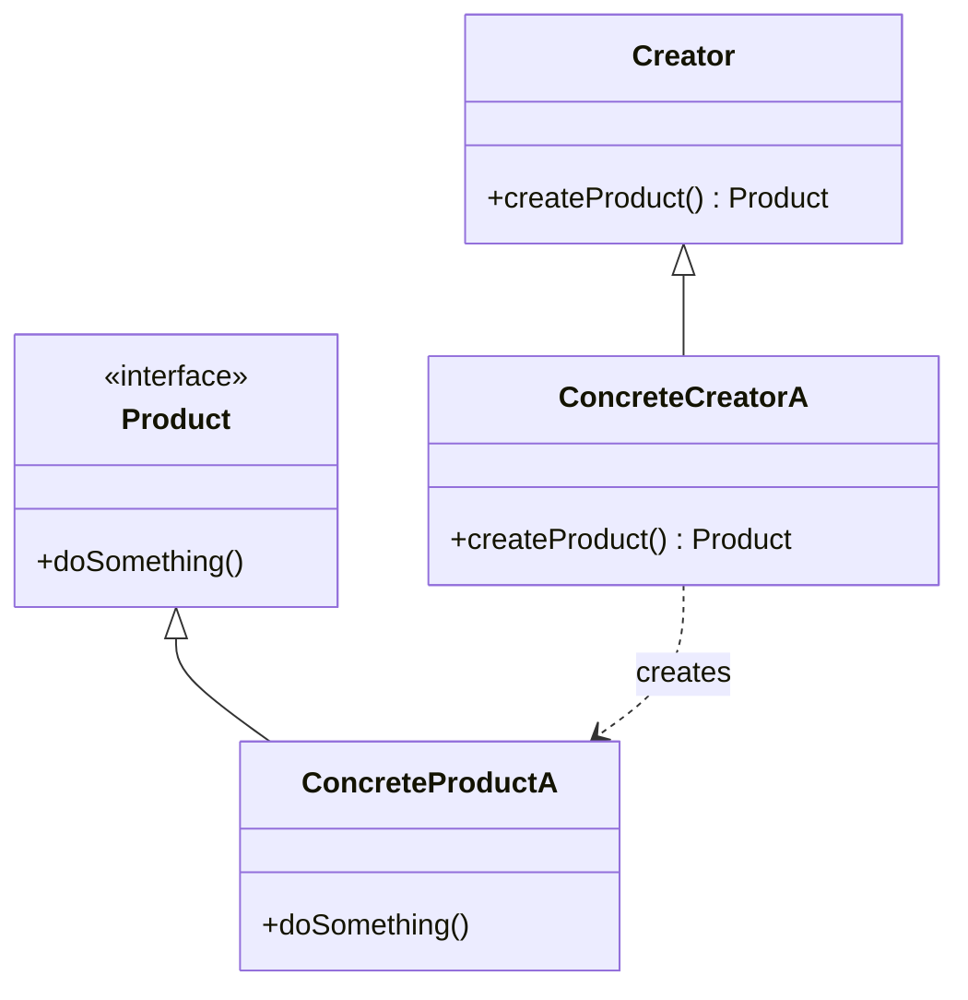

### Builder
*   **Description:** Lets you construct complex objects step by step. The pattern allows you to produce different types and representations of an object using the same construction code.
*   **Advantages:** Allows varying a product's internal representation; isolates code for construction and representation.
*   **Disadvantages:** Requires creating a separate ConcreteBuilder for each different type of product.
*   **Use Cases:** Constructing a complex `Computer` object with various components (CPU, RAM, GPU, etc.).
*   **Why we use it?:** To solve the "telescoping constructor" problem and provide a clean API for complex object creation.
*   **UML Diagram:**
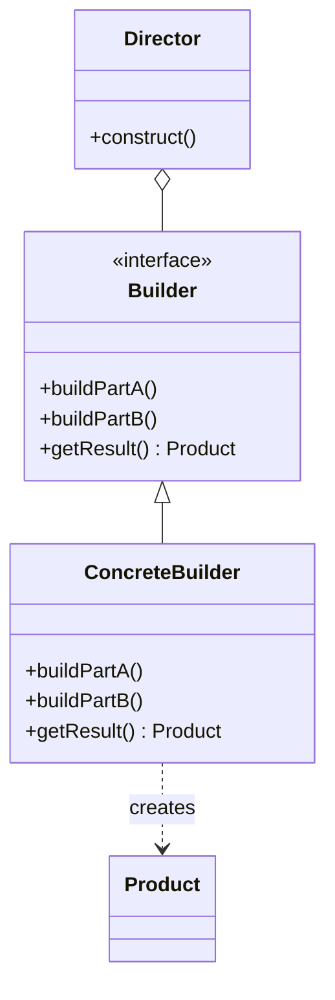

### Singleton
*   **Description:** Ensures that a class has only one instance and provides a global point of access to it.
*   **Advantages:** Controlled access to the sole instance; reduced namespace pollution.
*   **Disadvantages:** Can hide dependencies; difficult to unit test; violates SRP.
*   **Use Cases:** Logger, Database Connection Pool, Configuration Manager.
*   **Why we use it?:** To manage shared resources that must have a single point of truth.
*   **UML Diagram:**
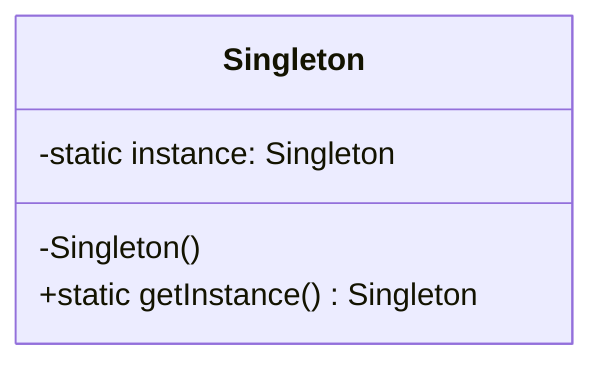

---

## 3. Structural Design Patterns

### Adapter
*   **Description:** Allows objects with incompatible interfaces to collaborate.
*   **Advantages:** Reusability of existing classes even if their interfaces don't match.
*   **Disadvantages:** Increased complexity by introducing new interfaces and classes.
*   **Use Cases:** Integrating a 3rd party legacy library into a modern system.
*   **Why we use it?:** To act as a "translator" between incompatible APIs.
*   **UML Diagram:**
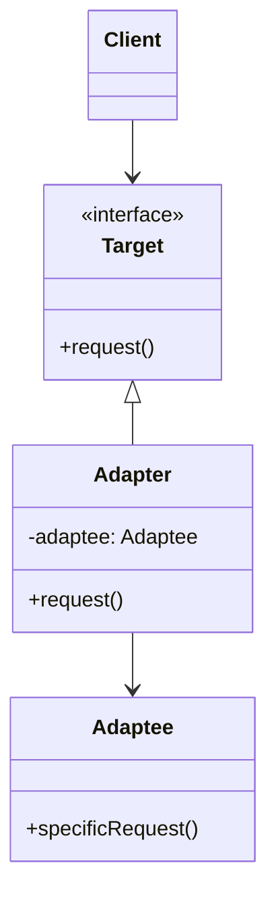

### Bridge
*   **Description:** Lets you split a large class or a set of closely related classes into two separate hierarchies—abstraction and implementation—which can be developed independently.
*   **Advantages:** Decouples abstraction from implementation; improves extensibility.
*   **Disadvantages:** Might make the code more complicated if applied to a highly cohesive class.
*   **Use Cases:** Supporting multiple operating systems with different GUI implementations.
*   **Why we use it?:** To avoid an exponential explosion of subclasses (Cartesian product of variants).
*   **UML Diagram:**
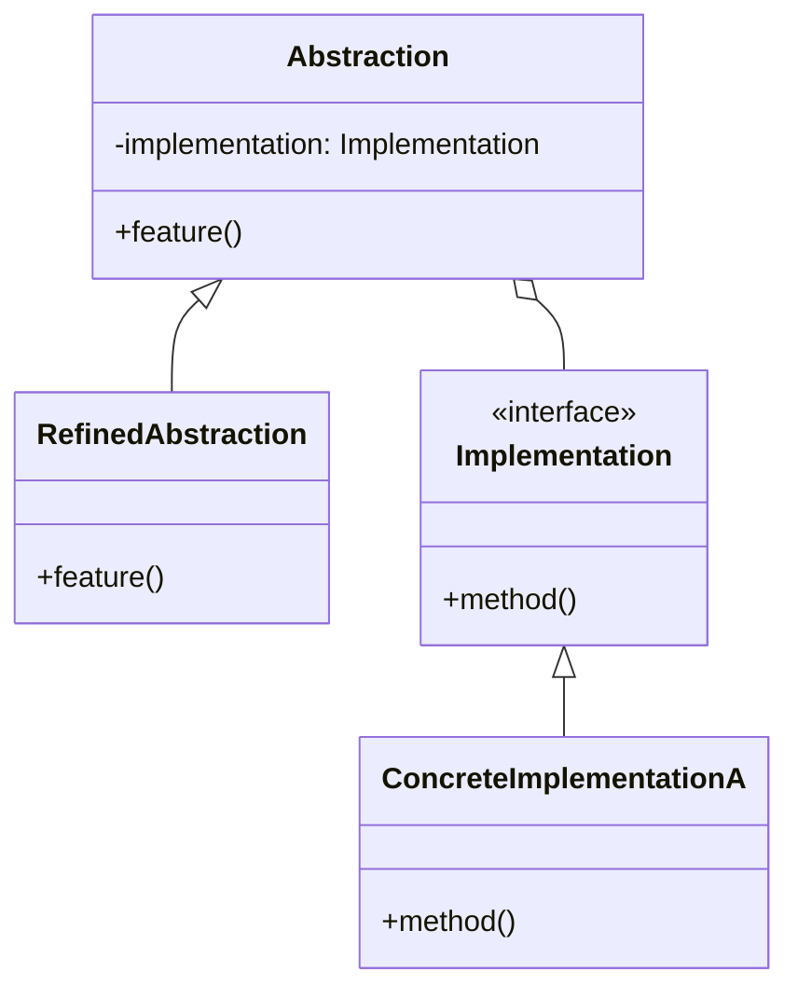

### Composite
*   **Description:** Lets you compose objects into tree structures and then work with these structures as if they were individual objects.
*   **Advantages:** Simplifies client code by treating complex and primitive objects uniformly.
*   **Disadvantages:** Can make the design over-generalized.
*   **Use Cases:** File systems (Files and Folders), GUI component hierarchies.
*   **Why we use it?:** To model part-whole hierarchies.
*   **UML Diagram:**
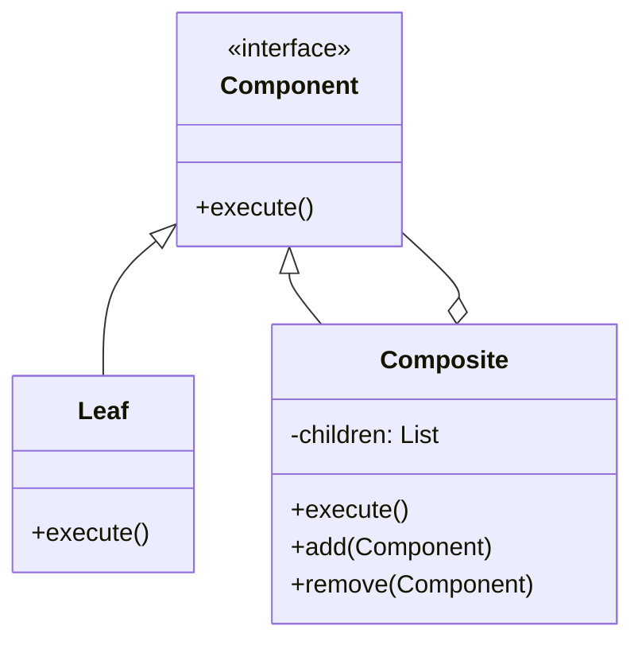

### Decorator
*   **Description:** Lets you attach new behaviors to objects by placing these objects inside special wrapper objects that contain the behaviors.
*   **Advantages:** More flexible than inheritance; allows adding responsibilities at runtime.
*   **Disadvantages:** Hard to remove a specific wrapper from the stack; many small objects.
*   **Use Cases:** Adding toppings to a pizza, adding encryption/compression to a data stream.
*   **Why we use it?:** To follow the Open/Closed Principle while extending functionality.
*   **UML Diagram:**
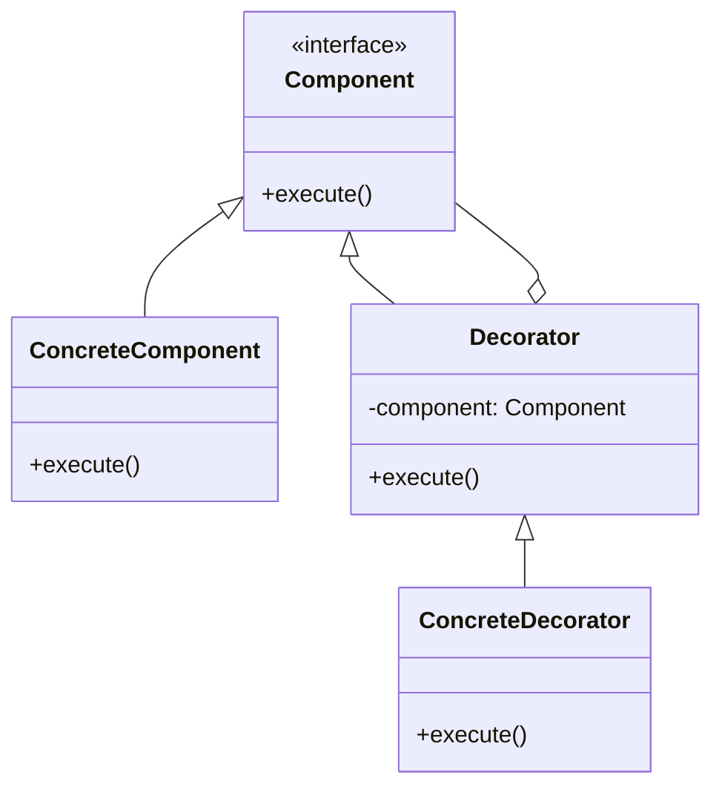

### Facade
*   **Description:** Provides a simplified interface to a library, a framework, or any other complex set of classes.
*   **Advantages:** Isolates clients from subsystem components; reduces coupling.
*   **Disadvantages:** A facade can become a "god object" coupled to all classes of an app.
*   **Use Cases:** A `HomeTheater` facade that manages `Lights`, `TV`, `Projector`, and `SoundSystem`.
*   **Why we use it?:** To provide an easy-to-use entry point to a complex system.
*   **UML Diagram:**
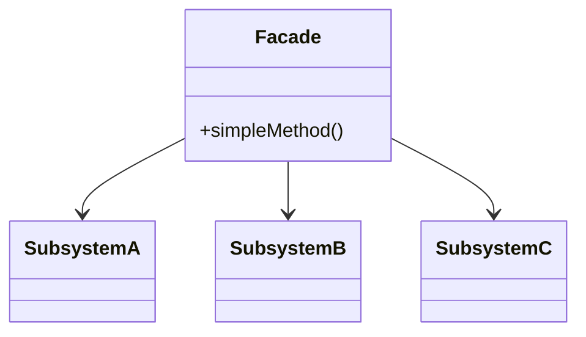

### Flyweight
*   **Description:** Lets you fit more objects into the available amount of RAM by sharing common parts of state between multiple objects instead of keeping all of the data in each object.
*   **Advantages:** Drastically reduces memory consumption for applications with massive amounts of objects.
*   **Disadvantages:** Might trade RAM for CPU cycles (to calculate extrinsic state); complicates the code.
*   **Use Cases:** Forest simulation with millions of trees sharing the same texture data.
*   **Why we use it?:** For extreme memory optimization when dealing with identical object state.
*   **UML Diagram:**
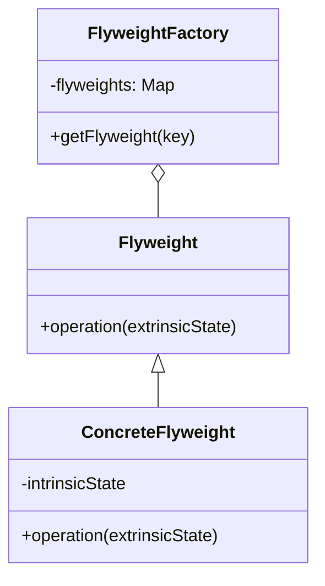

### Proxy
*   **Description:** Lets you provide a substitute or placeholder for another object. A proxy controls access to the original object, allowing you to perform something either before or after the request gets through to the original object.
*   **Advantages:** Security, caching, lazy initialization, logging.
*   **Disadvantages:** The response from the service might be delayed; introduces another layer of abstraction.
*   **Use Cases:** Virtual Proxy for heavy images, Protection Proxy for restricted data.
*   **Why we use it?:** To control or enhance access to a sensitive or resource-intensive object.
*   **UML Diagram:**
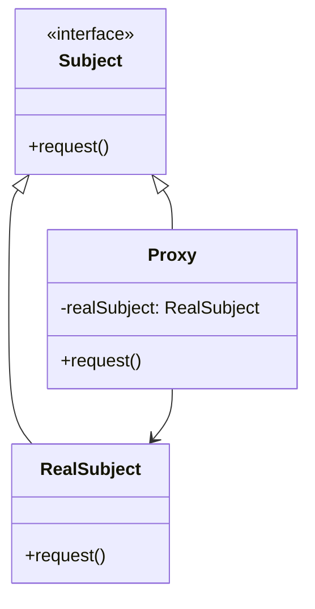

---

## 4. Behavioral Design Patterns

### Chain of Responsibility
*   **Description:** Lets you pass requests along a chain of handlers. Upon receiving a request, each handler decides either to process the request or to pass it to the next handler in the chain.
*   **Advantages:** Reduced coupling; flexibility in assigning responsibilities.
*   **Disadvantages:** No guarantee that the request will be handled; can be hard to debug.
*   **Use Cases:** Loggers with different levels (INFO, DEBUG, ERROR), GUI event bubbling.
*   **Why we use it?:** To decouple the sender of a request from its receivers.
*   **UML Diagram:**
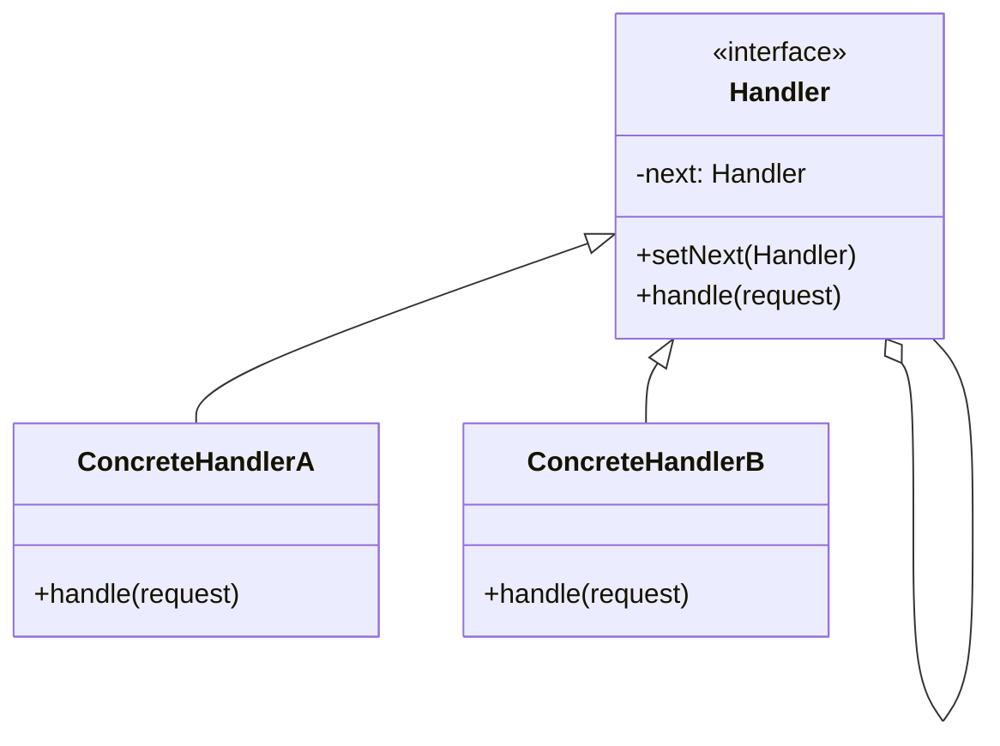

### Command
*   **Description:** Turns a request into a stand-alone object that contains all information about the request. This transformation lets you pass requests as a method arguments, delay or queue a request's execution, and support undoable operations.
*   **Advantages:** Decouples the object that invokes the operation from the one that knows how to perform it.
*   **Disadvantages:** Code becomes more complicated as you introduce a new layer between senders and receivers.
*   **Use Cases:** Undo/Redo systems, transaction management, GUI buttons and menu items.
*   **Why we use it?:** To parameterize objects with actions.
*   **UML Diagram:**
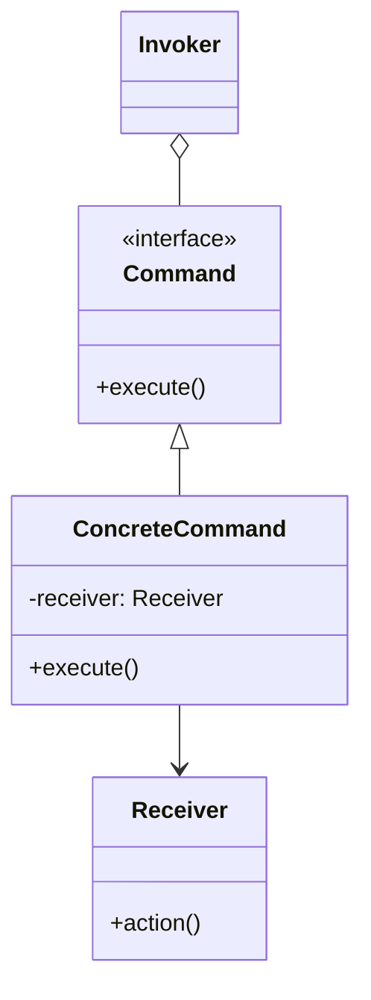

### Iterator
*   **Description:** Lets you traverse elements of a collection without exposing its underlying representation (list, stack, tree, etc.).
*   **Advantages:** Clean client code; supports multiple simultaneous traversals.
*   **Disadvantages:** Overkill for simple collections; can be less efficient than direct traversal.
*   **Use Cases:** Traversing custom data structures like a `Bookshelf`.
*   **Why we use it?:** To provide a uniform way to traverse different types of collections.
*   **UML Diagram:**
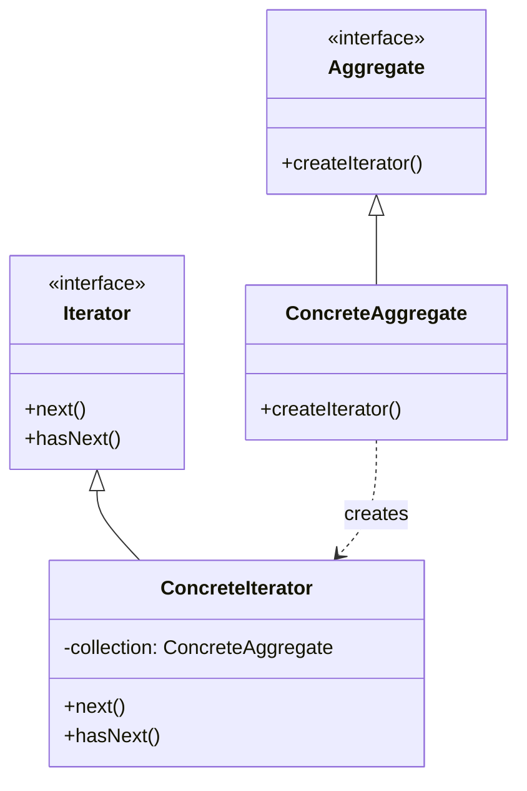

### Observer
*   **Description:** Lets you define a subscription mechanism to notify multiple objects about any events that happen to the object they’re observing.
*   **Advantages:** Follows the Open/Closed Principle; established a "push" model of communication.
*   **Disadvantages:** Subscribers are notified in random order; possible memory leaks if not unsubscribed.
*   **Use Cases:** Weather stations, stock market alerts, UI event listeners.
*   **Why we use it?:** To implement event-driven communication between objects.
*   **UML Diagram:**
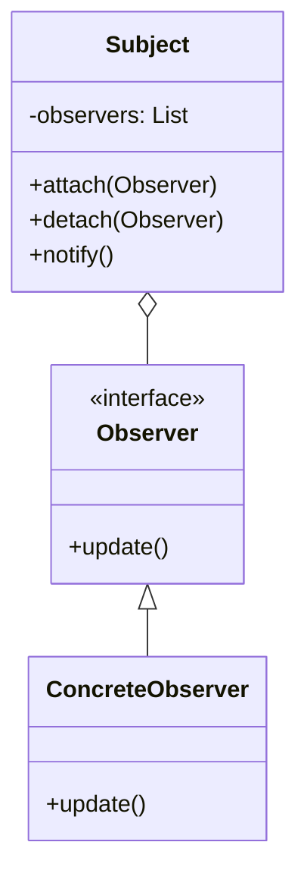

### Strategy
*   **Description:** Lets you define a family of algorithms, put each of them into a separate class, and make their objects interchangeable.
*   **Advantages:** Swapping algorithms at runtime; isolating algorithm implementation from the client.
*   **Disadvantages:** Clients must be aware of the differences between strategies to choose the right one.
*   **Use Cases:** Different payment methods (PayPal, Credit Card), different sorting algorithms.
*   **Why we use it?:** To avoid massive conditional blocks when choosing between algorithm variants.
*   **UML Diagram:**
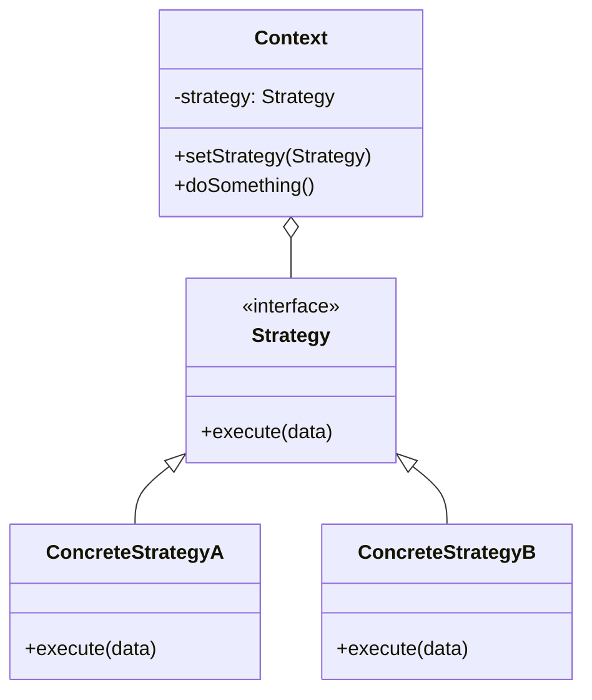

### Template Method
*   **Description:** Defines the skeleton of an algorithm in the superclass but lets subclasses override specific steps of the algorithm without changing its structure.
*   **Advantages:** Code reuse; provides a framework for subclasses.
*   **Disadvantages:** Limited by the skeleton; might violate LSP if not careful.
*   **Use Cases:** Data processing pipelines (Read -> Process -> Write), baking recipes.
*   **Why we use it?:** To enforce a specific workflow while allowing customization of individual steps.
*   **UML Diagram:**
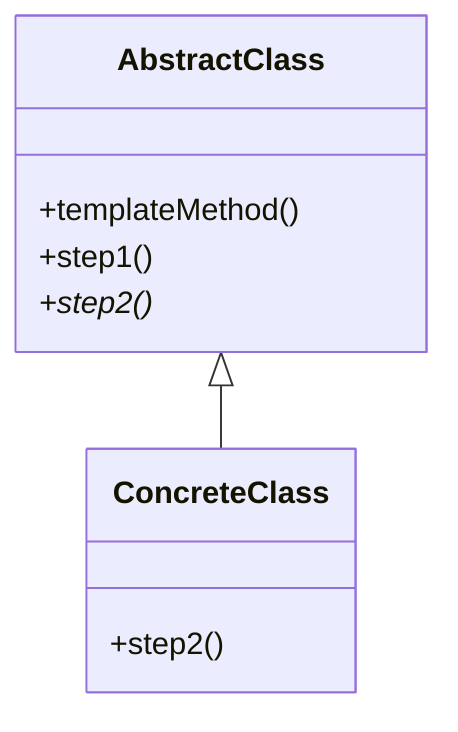

---

## 5. 🍔 Food Delivery Application

The `foodDelivery` application is a practical implementation of various design patterns to solve real-world problems in a food delivery ecosystem.

### Overview
The system handles user authentication, restaurant management, cart management, and order processing with multiple payment and delivery options.

### Patterns Used
*   **Factory Pattern:** Used in `OrderFactory` to create different types of orders (`NowOrder`, `ScheduledOrder`).
*   **Strategy Pattern:** Used for `PaymentStrategy` to support multiple payment methods (Credit Card, UPI).
*   **Singleton Pattern:** Likely used for `RestaurantManager` or `OrderManager` to ensure centralized control.
*   **Model-View-Controller (MVC) Influence:** The structure separates models (`User`, `Restaurant`, `Order`) from managers/services.

### System UML Diagram
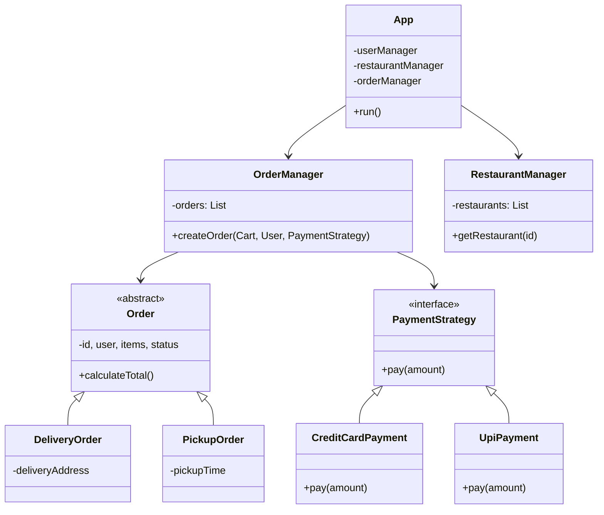
