# 🏛️ The Complete System Design & Design Patterns Encyclopedia (C++)

This repository is an exhaustive reference guide covering **Object-Oriented Programming (OOP)**, **SOLID Principles**, and **16 Design Patterns**. It includes detailed theory, practical code-based examples, and comprehensive UML diagrams that match the implementation exactly.

---

## 📑 Table of Contents
1. [🧩 Object-Oriented Programming (OOP) Pillars](#1-oop-pillars)
2. [🎯 SOLID Design Principles](#2-solid-design-principles)
3. [🏗️ Creational Design Patterns](#3-creational-patterns)
4. [🧱 Structural Design Patterns](#4-structural-patterns)
5. [🔄 Behavioral Design Patterns](#5-behavioral-patterns)
6. [🍔 Case Study: Food Delivery Application](#6-case-study-food-delivery-application)

---

## 1. 🧩 OOP Pillars

### 🧱 Encapsulation
*   **Definition:** The practice of bundling data (attributes) and the methods (functions) that operate on that data into a single unit (class). It restricts direct access to some components using `private` and `protected` modifiers.
*   **Why we use it?:**
    *   **Data Protection:** Prevents external code from corrupting an object's internal state.
    *   **Abstraction of Complexity:** Users of the class don't need to know *how* data is stored, only *what* they can do with it.
*   **Real-world Analogy:** A Bank ATM. You can't see the internal cash count or electronics; you only interact with a specific set of public buttons and screens.

### 🔍 Abstraction
*   **Definition:** Hiding the complex implementation details and showing only the essential features of an object.
*   **Why we use it?:**
    *   **Reduces Complexity:** Allows developers to work with high-level concepts without being bogged down by low-level logic.
    *   **Decoupling:** If the implementation changes, the interface remains the same, preventing breaking changes.
*   **Real-world Analogy:** Driving a car. You know how to use the steering wheel and pedals (the interface), but you don't need to know the thermodynamics of the engine (the abstraction).

### 🧬 Inheritance
*   **Definition:** A mechanism where a new class (subclass) derives properties and behaviors from an existing class (superclass).
*   **Why we use it?:**
    *   **Code Reusability:** Eliminates redundancy by sharing common code in a parent class.
    *   **Hierarchy:** Models "is-a" relationships (e.g., a Dog is a Mammal).
*   **Real-world Analogy:** A Smartphone inherits the properties of a traditional Phone (calling, texting) but adds new ones (apps, camera).

### 🎭 Polymorphism
*   **Definition:** The ability of different classes to respond to the same function call in their own unique way.
*   **Why we use it?:**
    *   **Extensibility:** You can write a single function that works with any object that follows a specific interface.
*   **Real-world Analogy:** The command "Speak". A dog barks, a cat meows, and a human talks. The command is the same, but the result depends on the recipient.

---

## 2. 🎯 SOLID Design Principles

### 1. Single Responsibility Principle (SRP)
*   **Description:** A class should have one, and only one, reason to change.
*   **Advantages:** Improved maintainability, easier testing, and reduced coupling.
*   **Disadvantages:** Can lead to a high number of small classes.
*   **Use Cases:** Separating a `Report` generation logic from the `FileSaver` logic.
*   **Why we use it?:** To prevent "God Objects" that are impossible to maintain.
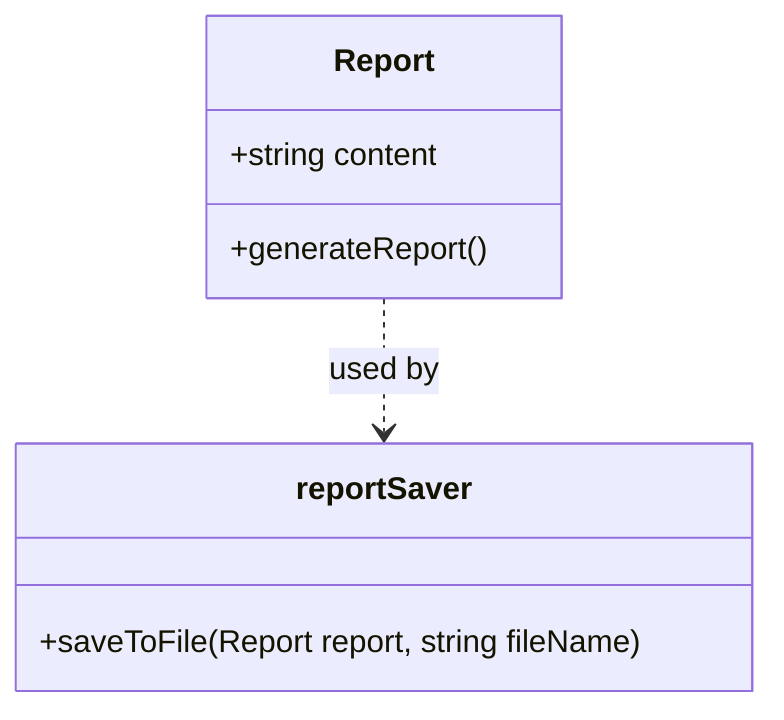
```mermaid
classDiagram
    class Report {
        +string content
        +generateReport()
    }
    class reportSaver {
        +saveToFile(Report report, string fileName)
    }
    Report ..> reportSaver : used by
```

### 2. Open/Closed Principle (OCP)
*   **Description:** Software entities should be open for extension but closed for modification.
*   **Advantages:** New features can be added without risking bugs in existing code.
*   **Use Cases:** Adding new payment methods or discount types.
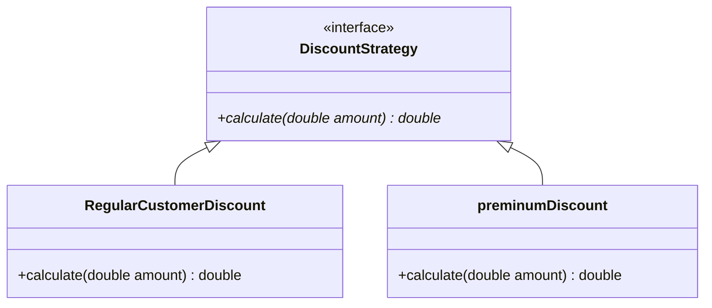
```mermaid
classDiagram
    class DiscountStrategy {
        <<interface>>
        +calculate(double amount)* double
    }
    class RegularCustomerDiscount {
        +calculate(double amount) double
    }
    class preminumDiscount {
        +calculate(double amount) double
    }
    DiscountStrategy <|-- RegularCustomerDiscount
    DiscountStrategy <|-- preminumDiscount
```

### 3. Liskov Substitution Principle (LSP)
*   **Description:** Subclasses must be 100% substitutable for their base classes without altering the correctness of the program.
*   **Why we use it?:** To ensure that polymorphism doesn't lead to unexpected behavior or crashes.
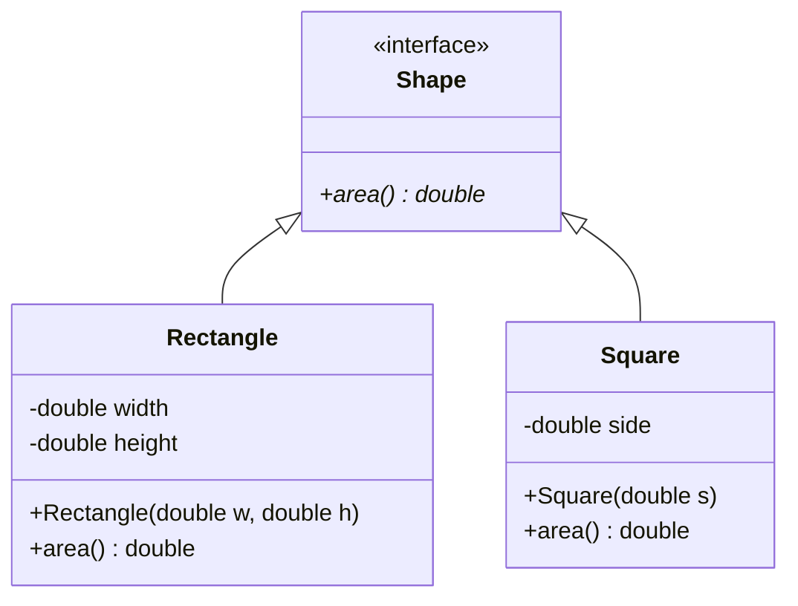
```mermaid
classDiagram
    class Shape {
        <<interface>>
        +area()* double
    }
    class Rectangle {
        -double width
        -double height
        +Rectangle(double w, double h)
        +area() double
    }
    class Square {
        -double side
        +Square(double s)
        +area() double
    }
    Shape <|-- Rectangle
    Shape <|-- Square
```

### 4. Interface Segregation Principle (ISP)
*   **Description:** Clients should not be forced to depend on interfaces they do not use.
*   **Advantages:** Prevents "fat" interfaces that force irrelevant implementations.
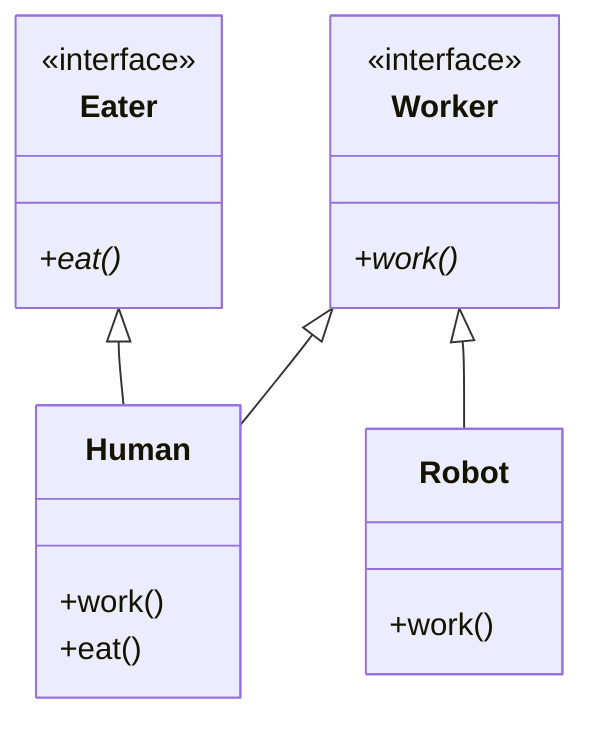
```mermaid
classDiagram
    class Worker {
        <<interface>>
        +work()*
    }
    class Eater {
        <<interface>>
        +eat()*
    }
    class Human {
        +work()
        +eat()
    }
    class Robot {
        +work()
    }
    Worker <|-- Human
    Eater <|-- Human
    Worker <|-- Robot
```

### 5. Dependency Inversion Principle (DIP)
*   **Description:** High-level modules should depend on abstractions, not on concrete implementations.
*   **Why we use it?:** To decouple system components, making them easier to swap or upgrade.
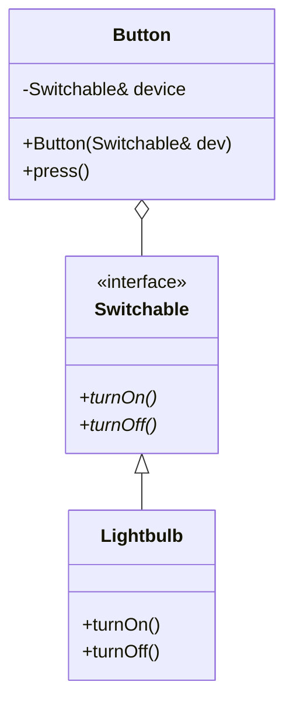
```mermaid
classDiagram
    class Switchable {
        <<interface>>
        +turnOn()*
        +turnOff()*
    }
    class Lightbulb {
        +turnOn()
        +turnOff()
    }
    class Button {
        -Switchable& device
        +Button(Switchable& dev)
        +press()
    }
    Switchable <|-- Lightbulb
    Button o-- Switchable
```

---

## 3. 🏗️ Creational Patterns

### 🏭 Factory Method & Abstract Factory
*   **Description:** Provides an interface for creating objects but allows subclasses to decide the type. Abstract Factory creates families of related objects.
*   **Advantages:** Decouples the client from the implementation classes; promotes OCP.
*   **Disadvantages:** Introduces many new classes and layers.
*   **Use Cases:** Creating UI components (Buttons, Checkboxes) for different OS (Mac vs Windows).
*   **Why we use it?:** To manage complex object creation centrally.
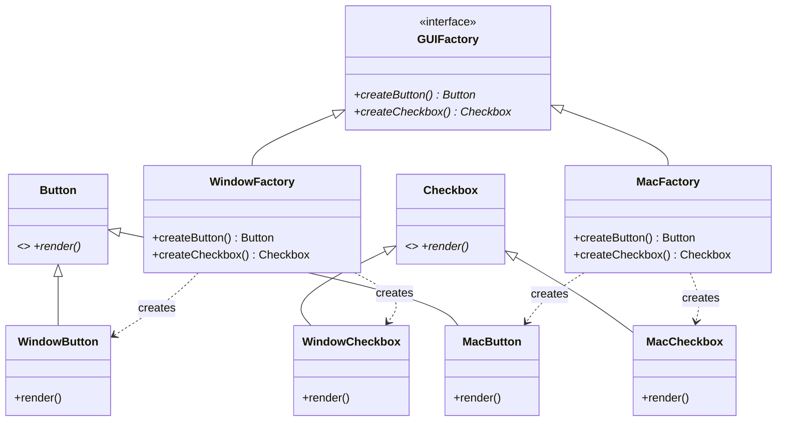
```mermaid
classDiagram
    class Button { <<interface>> +render()* }
    class Checkbox { <<interface>> +render()* }
    class WindowButton { +render() }
    class MacButton { +render() }
    class WindowCheckbox { +render() }
    class MacCheckbox { +render() }
    
    class GUIFactory {
        <<interface>>
        +createButton()* Button
        +createCheckbox()* Checkbox
    }
    class WindowFactory {
        +createButton() Button
        +createCheckbox() Checkbox
    }
    class MacFactory {
        +createButton() Button
        +createCheckbox() Checkbox
    }

    Button <|-- WindowButton
    Button <|-- MacButton
    Checkbox <|-- WindowCheckbox
    Checkbox <|-- MacCheckbox
    GUIFactory <|-- WindowFactory
    GUIFactory <|-- MacFactory
    WindowFactory ..> WindowButton : creates
    WindowFactory ..> WindowCheckbox : creates
    MacFactory ..> MacButton : creates
    MacFactory ..> MacCheckbox : creates
```

### 👷 Builder
*   **Description:** Constructs complex objects step-by-step, providing a readable API for configuration.
*   **Advantages:** Encapsulates construction code; allows creating different representations.
*   **Use Cases:** Creating a `Computer` with optional RAM, GPU, and Storage configurations.
*   **Why we use it?:** To avoid "telescoping constructors" with too many parameters.
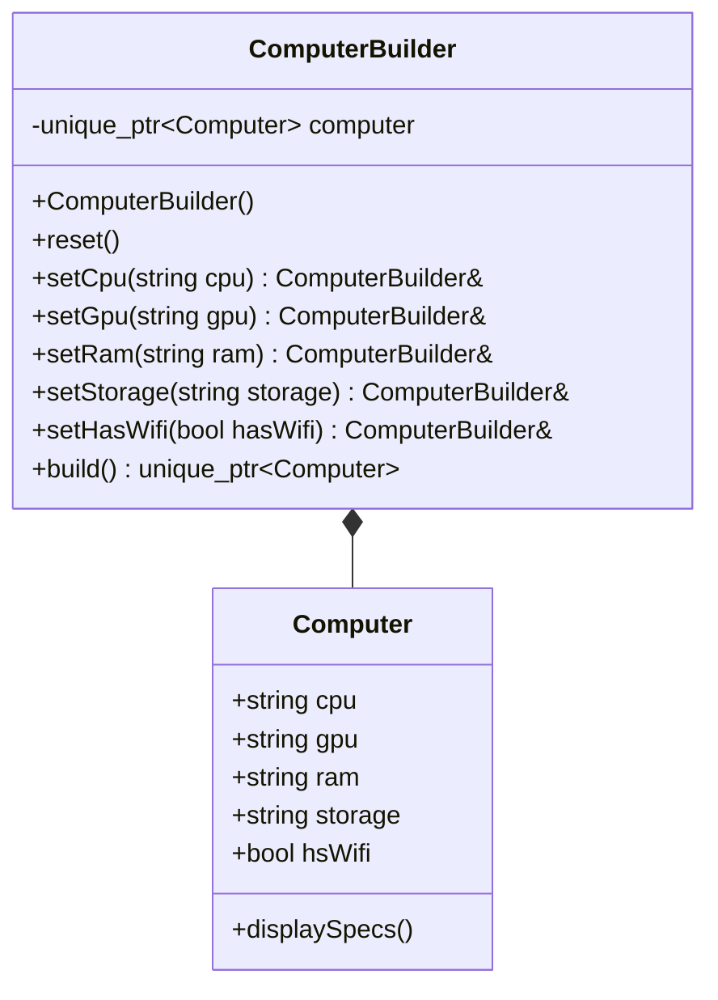
```mermaid
classDiagram
    class Computer {
        +string cpu
        +string gpu
        +string ram
        +string storage
        +bool hsWifi
        +displaySpecs()
    }
    class ComputerBuilder {
        -unique_ptr~Computer~ computer
        +ComputerBuilder()
        +reset()
        +setCpu(string cpu) ComputerBuilder&
        +setGpu(string gpu) ComputerBuilder&
        +setRam(string ram) ComputerBuilder&
        +setStorage(string storage) ComputerBuilder&
        +setHasWifi(bool hasWifi) ComputerBuilder&
        +build() unique_ptr~Computer~
    }
    ComputerBuilder *-- Computer
```

### 👑 Singleton
*   **Description:** Ensures a class has only one instance and provides a global access point.
*   **Advantages:** Controlled access to a shared resource (e.g., config, logging).
*   **Disadvantages:** Violates SRP; difficult to unit test; can hide dependencies.
*   **Why we use it?:** To prevent duplicate resource management.
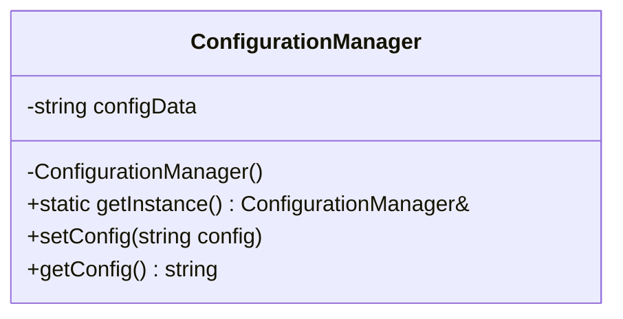
```mermaid
classDiagram
    class ConfigurationManager {
        -string configData
        -ConfigurationManager()
        +static getInstance() ConfigurationManager&
        +setConfig(string config)
        +getConfig() string
    }
```

---

## 4. 🧱 Structural Patterns

### 🔌 Adapter
*   **Description:** Acts as a translator between two incompatible interfaces.
*   **Advantages:** Reuses existing classes without modification.
*   **Use Cases:** Using an `OldMicroUsbPhone` with a `TypeCPhone` charger.
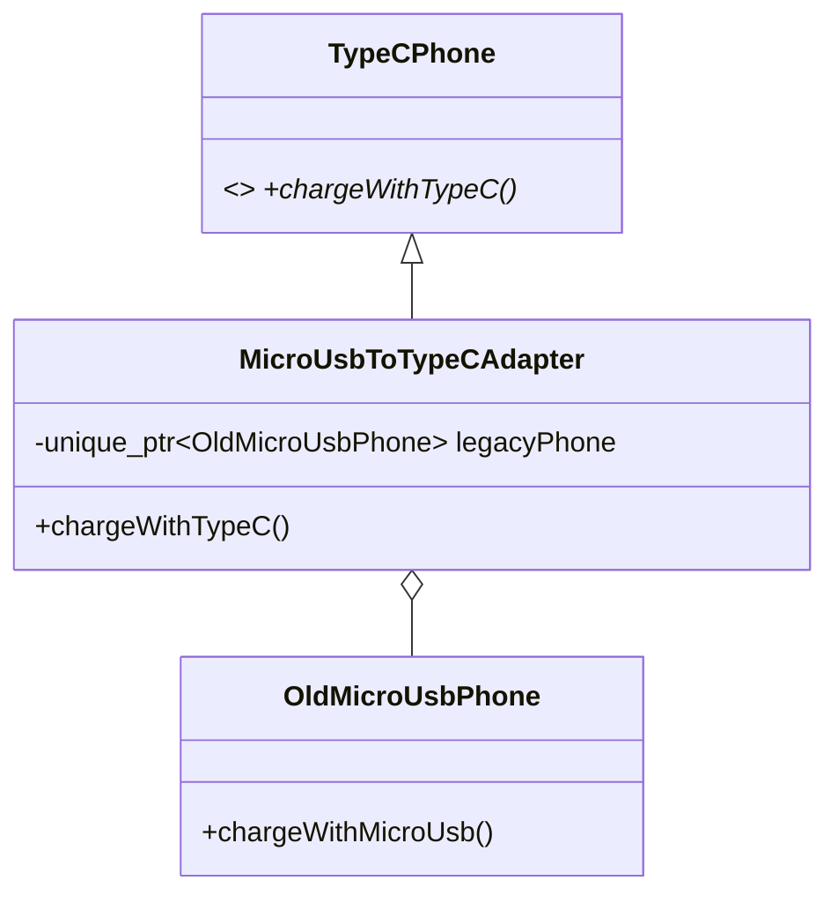
```mermaid
classDiagram
    class TypeCPhone { <<interface>> +chargeWithTypeC()* }
    class OldMicroUsbPhone { +chargeWithMicroUsb() }
    class MicroUsbToTypeCAdapter {
        -unique_ptr~OldMicroUsbPhone~ legacyPhone
        +chargeWithTypeC()
    }
    TypeCPhone <|-- MicroUsbToTypeCAdapter
    MicroUsbToTypeCAdapter o-- OldMicroUsbPhone
```

### 🌉 Bridge
*   **Description:** Splits a class into two hierarchies (Abstraction and Implementation) to vary them independently.
*   **Advantages:** Hides implementation details; allows switching implementations at runtime.
*   **Use Cases:** Remote controls that work with different devices (TV, Radio).
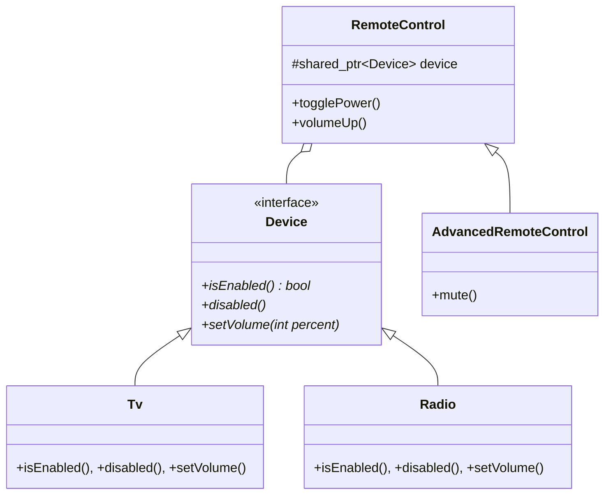
```mermaid
classDiagram
    class Device {
        <<interface>>
        +isEnabled()* bool
        +disabled()*
        +setVolume(int percent)*
    }
    class Tv { +isEnabled(), +disabled(), +setVolume() }
    class Radio { +isEnabled(), +disabled(), +setVolume() }
    class RemoteControl {
        #shared_ptr~Device~ device
        +togglePower()
        +volumeUp()
    }
    class AdvancedRemoteControl { +mute() }
    
    Device <|-- Tv
    Device <|-- Radio
    RemoteControl o-- Device
    RemoteControl <|-- AdvancedRemoteControl
```

### 🌳 Composite
*   **Description:** Composes objects into tree structures to represent part-whole hierarchies.
*   **Advantages:** Client can treat individual items and groups of items identically.
*   **Use Cases:** File systems where folders contain files and other folders.
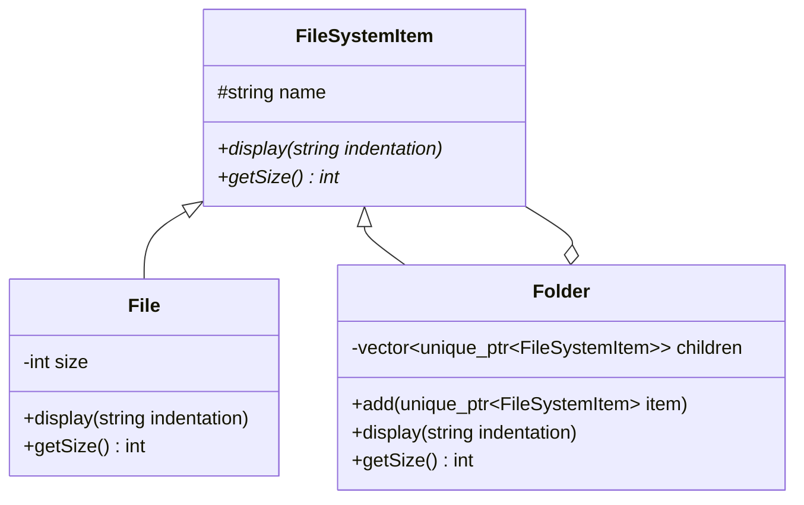
```mermaid
classDiagram
    class FileSystemItem {
        #string name
        +display(string indentation)*
        +getSize()* int
    }
    class File {
        -int size
        +display(string indentation)
        +getSize() int
    }
    class Folder {
        -vector~unique_ptr~FileSystemItem~~ children
        +add(unique_ptr~FileSystemItem~ item)
        +display(string indentation)
        +getSize() int
    }
    FileSystemItem <|-- File
    FileSystemItem <|-- Folder
    Folder o-- FileSystemItem
```

### 🧣 Decorator
*   **Description:** Dynamically adds behavior to an object by wrapping it.
*   **Advantages:** More flexible than inheritance; follows OCP.
*   **Use Cases:** Adding toppings like `Milk` or `Sugar` to a `Beverage`.
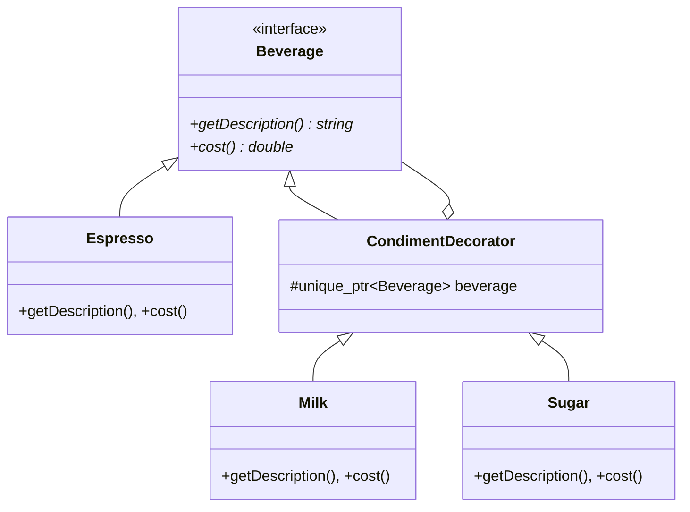
```mermaid
classDiagram
    class Beverage {
        <<interface>>
        +getDescription()* string
        +cost()* double
    }
    class Espresso { +getDescription(), +cost() }
    class CondimentDecorator {
        #unique_ptr~Beverage~ beverage
    }
    class Milk { +getDescription(), +cost() }
    class Sugar { +getDescription(), +cost() }

    Beverage <|-- Espresso
    Beverage <|-- CondimentDecorator
    CondimentDecorator <|-- Milk
    CondimentDecorator <|-- Sugar
    CondimentDecorator o-- Beverage
```

### 🏛️ Facade
*   **Description:** Provides a simplified, high-level interface to a complex set of subsystem classes.
*   **Advantages:** Reduces dependencies between clients and subsystems.
*   **Use Cases:** A `HomeTheaterFacade` controlling `Lights`, `Projector`, and `Amplifier`.
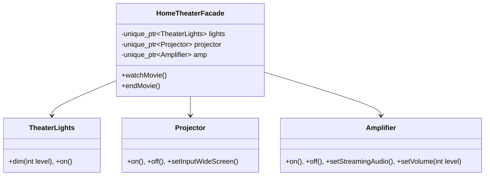
```mermaid
classDiagram
    class HomeTheaterFacade {
        -unique_ptr~TheaterLights~ lights
        -unique_ptr~Projector~ projector
        -unique_ptr~Amplifier~ amp
        +watchMovie()
        +endMovie()
    }
    class TheaterLights { +dim(int level), +on() }
    class Projector { +on(), +off(), +setInputWideScreen() }
    class Amplifier { +on(), +off(), +setStreamingAudio(), +setVolume(int level) }

    HomeTheaterFacade --> TheaterLights
    HomeTheaterFacade --> Projector
    HomeTheaterFacade --> Amplifier
```

### 🪶 Flyweight
*   **Description:** Minimizes memory usage by sharing common state between similar objects.
*   **Advantages:** Massive memory savings for systems with millions of objects.
*   **Use Cases:** A forest simulation sharing `TreeModel` (texture/color) among millions of `Tree` objects.
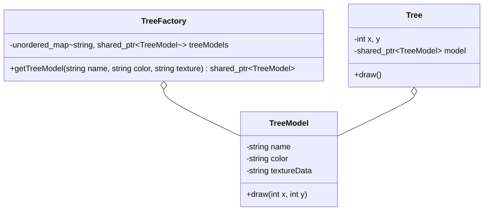
```mermaid
classDiagram
    class TreeModel {
        -string name
        -string color
        -string textureData
        +draw(int x, int y)
    }
    class TreeFactory {
        -unordered_map~string, shared_ptr~TreeModel~~ treeModels
        +getTreeModel(string name, string color, string texture) shared_ptr~TreeModel~
    }
    class Tree {
        -int x, y
        -shared_ptr~TreeModel~ model
        +draw()
    }
    TreeFactory o-- TreeModel
    Tree o-- TreeModel
```

### 🛡️ Proxy
*   **Description:** Provides a substitute or placeholder for another object to control access, lazy-load, or log.
*   **Advantages:** Security; performance (lazy loading); remote access management.
*   **Use Cases:** An `ImageProxy` that only loads a `HighResImage` when `draw()` is actually called.
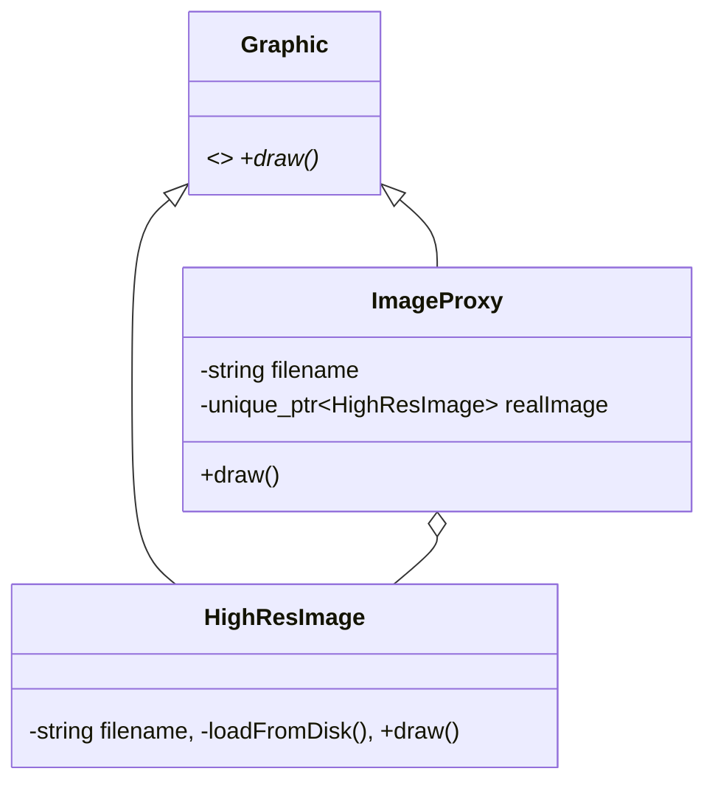
```mermaid
classDiagram
    class Graphic { <<interface>> +draw()* }
    class HighResImage { -string filename, -loadFromDisk(), +draw() }
    class ImageProxy {
        -string filename
        -unique_ptr~HighResImage~ realImage
        +draw()
    }
    Graphic <|-- HighResImage
    Graphic <|-- ImageProxy
    ImageProxy o-- HighResImage
```

---

## 5. 🔄 Behavioral Design Patterns

### 🔗 Chain of Responsibility
*   **Description:** Passes a request along a chain of handlers until one handles it.
*   **Advantages:** Decouples sender and receiver; flexible chain modification.
*   **Use Cases:** Support ticketing system (AI Chatbot -> Human Agent -> Tech Lead).
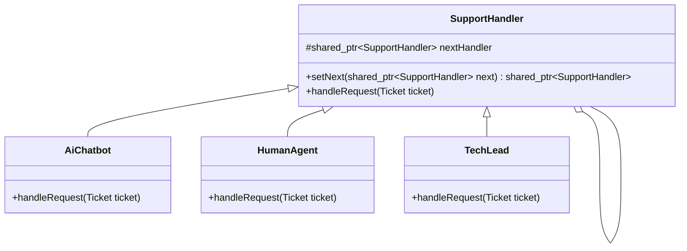
```mermaid
classDiagram
    class SupportHandler {
        #shared_ptr~SupportHandler~ nextHandler
        +setNext(shared_ptr~SupportHandler~ next) shared_ptr~SupportHandler~
        +handleRequest(Ticket ticket)
    }
    class AiChatbot { +handleRequest(Ticket ticket) }
    class HumanAgent { +handleRequest(Ticket ticket) }
    class TechLead { +handleRequest(Ticket ticket) }
    
    SupportHandler <|-- AiChatbot
    SupportHandler <|-- HumanAgent
    SupportHandler <|-- TechLead
    SupportHandler o-- SupportHandler
```

### 📜 Command
*   **Description:** Turns a request into a stand-alone object, allowing for undo/redo and action queuing.
*   **Advantages:** Decouples command invoker from the executor; supports complex operations.
*   **Use Cases:** Remote control buttons that can be mapped to different actions.
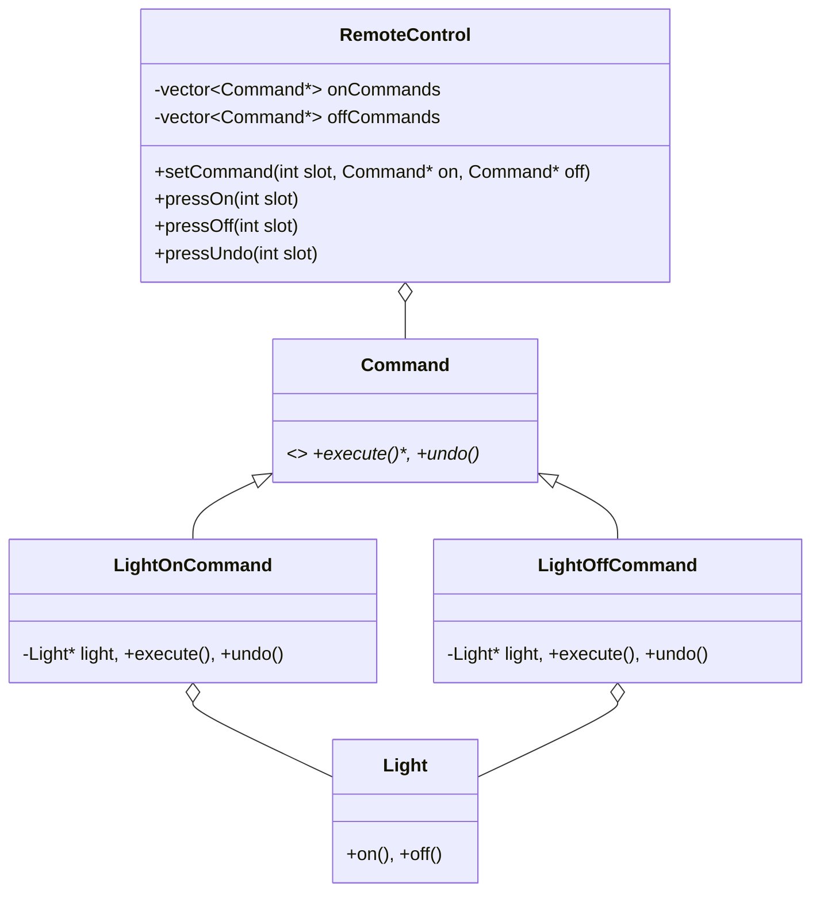
```mermaid
classDiagram
    class Command { <<interface>> +execute()*, +undo()* }
    class LightOnCommand { -Light* light, +execute(), +undo() }
    class LightOffCommand { -Light* light, +execute(), +undo() }
    class Light { +on(), +off() }
    class RemoteControl {
        -vector~Command*~ onCommands
        -vector~Command*~ offCommands
        +setCommand(int slot, Command* on, Command* off)
        +pressOn(int slot)
        +pressOff(int slot)
        +pressUndo(int slot)
    }
    Command <|-- LightOnCommand
    Command <|-- LightOffCommand
    LightOnCommand o-- Light
    LightOffCommand o-- Light
    RemoteControl o-- Command
```

### 📑 Iterator
*   **Description:** Provides a way to traverse elements of a collection without exposing its internal structure.
*   **Advantages:** Uniform traversal API; supports multiple simultaneous traversals.
*   **Use Cases:** Traversing a `Bookshelf` containing a `vector` of `Book` objects.
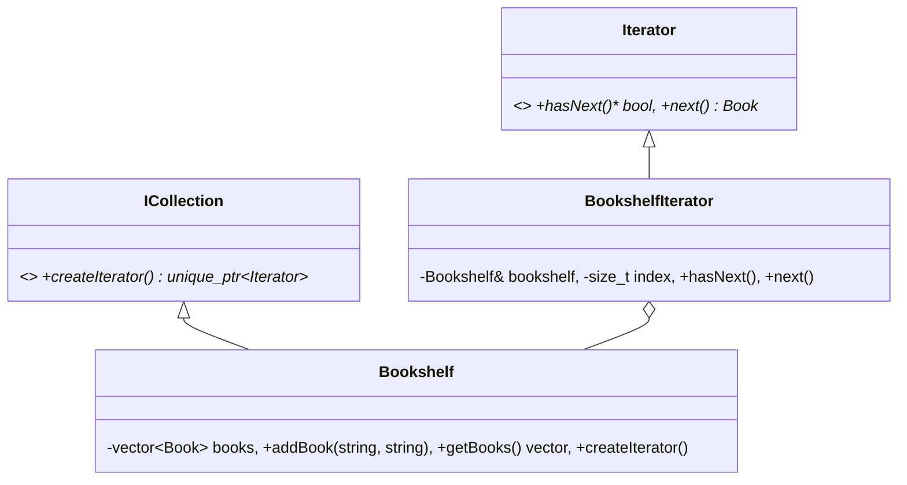
```mermaid
classDiagram
    class Iterator { <<interface>> +hasNext()* bool, +next()* Book }
    class ICollection { <<interface>> +createIterator()* unique_ptr~Iterator~ }
    class Bookshelf { -vector~Book~ books, +addBook(string, string), +getBooks() vector, +createIterator() }
    class BookshelfIterator { -Bookshelf& bookshelf, -size_t index, +hasNext(), +next() }
    
    Iterator <|-- BookshelfIterator
    ICollection <|-- Bookshelf
    BookshelfIterator o-- Bookshelf
```

### 🔔 Observer
*   **Description:** Defines a one-to-many relationship where one object notifies all dependents of state changes.
*   **Advantages:** Cleanly separates Subject and Observer; follows OCP.
*   **Use Cases:** A `WeatherStation` notifying `PhoneDisplay` and `WindowDisplay` of temperature updates.
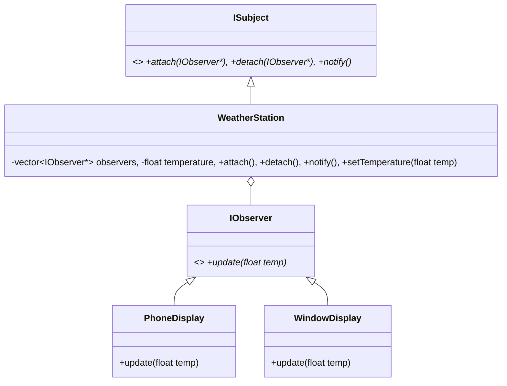
```mermaid
classDiagram
    class IObserver { <<interface>> +update(float temp)* }
    class ISubject { <<interface>> +attach(IObserver*), +detach(IObserver*), +notify()* }
    class WeatherStation { -vector~IObserver*~ observers, -float temperature, +attach(), +detach(), +notify(), +setTemperature(float temp) }
    class PhoneDisplay { +update(float temp) }
    class WindowDisplay { +update(float temp) }

    IObserver <|-- PhoneDisplay
    IObserver <|-- WindowDisplay
    ISubject <|-- WeatherStation
    WeatherStation o-- IObserver
```

### 🎯 Strategy
*   **Description:** Defines a family of algorithms and makes them interchangeable at runtime.
*   **Advantages:** Replaces conditional logic with polymorphism; allows algorithm swapping.
*   **Use Cases:** Switching between `CreditCardPayment` and `PayPalPayment` in a `ShoppingCart`.
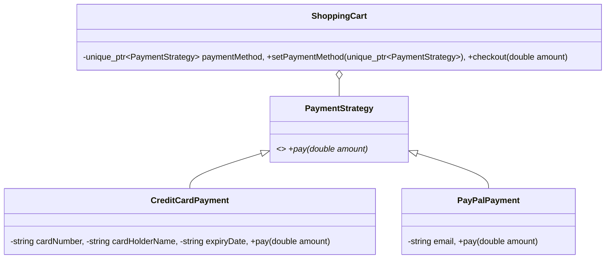
```mermaid
classDiagram
    class PaymentStrategy { <<interface>> +pay(double amount)* }
    class CreditCardPayment { -string cardNumber, -string cardHolderName, -string expiryDate, +pay(double amount) }
    class PayPalPayment { -string email, +pay(double amount) }
    class ShoppingCart { -unique_ptr~PaymentStrategy~ paymentMethod, +setPaymentMethod(unique_ptr~PaymentStrategy~), +checkout(double amount) }

    PaymentStrategy <|-- CreditCardPayment
    PaymentStrategy <|-- PayPalPayment
    ShoppingCart o-- PaymentStrategy
```

### 📋 Template Method
*   **Description:** Defines the skeleton of an algorithm in a base class, allowing subclasses to override specific steps.
*   **Advantages:** Code reuse; enforces a fixed sequence of operations.
*   **Use Cases:** A `DocumentParser` that defines the workflow (Open -> Extract -> Analyze -> Close) but lets `PdfParser` and `CsvParser` handle extraction.
```mermaid
classDiagram
    class DocumentParser {
        +processDocument(string filePath)
        #openFile(string path), #runAnalytics(), #closeFile()
        #extractRawText()*
        #hookSendNotification() bool
        #sendReport()
    }
    class PdfParser { #extractRawText(), #hookSendNotification() }
    class CsvParser { #extractRawText() }
    
    DocumentParser <|-- PdfParser
    DocumentParser <|-- CsvParser
```

---

## 6. 🍔 Case Study: Food Delivery Application

The Food Delivery Application serves as a real-world integration of multiple patterns (Factory, Strategy, Singleton) into a unified system.

### Detailed System UML Diagram
```mermaid
classDiagram
    class FoodDeliverySystem {
        -RestaurantManager* restaurantManager
        -OrderManager* orderManager
        -OrderFactory* orderFactory
        +FoodDeliverySystem()
        +~FoodDeliverySystem()
        +addRestaurant(Restaurant* r)
        +searchRestaurants(string location) vector~Restaurant*~
        +placeOrder(User* user, Restaurant* restaurant, PaymentStrategy* paymentMethod, string type) bool
        +showOrders()
    }

    class RestaurantManager {
        -vector~Restaurant*~ restaurants
        -static RestaurantManager* instance
        -RestaurantManager()
        +static getInstance() RestaurantManager*
        +addRestaurant(Restaurant* restaurant)
        +searchByLocation(string loc) vector~Restaurant*~
    }

    class OrderManager {
        -vector~Order*~ orders
        -static OrderManager* instance
        -OrderManager()
        +static getInstance() OrderManager*
        +addOrder(Order* order)
        +listOrders()
    }

    class OrderFactory {
        <<interface>>
        +createOrder(User* user, Cart* cart, Restaurant* restaurant, vector~MenuItem~ menuItems, PaymentStrategy* paymentStrategy, string orderType) Order*
    }

    class NowOrderFactory {
        +createOrder(User* user, Cart* cart, Restaurant* restaurant, vector~MenuItem~ menuItems, PaymentStrategy* paymentStrategy, string orderType) Order*
    }

    class Order {
        <<abstract>>
        #static int nextOrderId
        #int orderId
        #User* user
        #Restaurant* restaurant
        #vector~MenuItem~ items
        #PaymentStrategy* paymentStrategy
        #double total
        #string schedule
        #string status
        +Order()
        +virtual ~Order()
        +processPayment() bool
        +virtual getType() string*
        +getOrderId() int
        +setUser(User* u)
        +getUser() User*
        +setRestaurant(Restaurant* r)
        +getRestaurant() Restaurant*
        +setItems(vector~MenuItem~ items)
        +getItems() vector~MenuItem~
        +setPaymentStrategy(PaymentStrategy* strategy)
        +getStatus() string
        +setStatus(string s)
        +getTotalAmount() double
        +setTotal(double t)
        +setScheduled(string s)
        +getScheduled() string
    }

    class DeliveryOrder {
        -string userAddress
        +DeliveryOrder()
        +getType() string
        +setUserAddress(string address)
        +getUserAddress() string
    }

    class PickupOrder {
        -string restaurantAddress
        +PickupOrder()
        +getType() string
        +setRestaurantAddress(string address)
        +getRestaurantAddress() string
    }

    class User {
        -int userId
        -string name
        -string address
        -Cart* cart
        +User(int userId, string name, string address)
        +~User()
        +getName() string
        +getAddress() string
        +setaddress(string a)
        +getCart() Cart*
    }

    class Cart {
        -Restaurant* restaurant
        -vector~MenuItem~ items
        +Cart()
        +addItem(MenuItem item)
        +getTotalPrice() double
        +isEmpty() bool
        +clear()
        +setRestaurant(Restaurant* r)
        +getRestaurant() Restaurant*
        +getItems() vector~MenuItem~
    }

    class Restaurant {
        -static int nextRestaurantId
        -int restaurantId
        -string name
        -string location
        -vector~MenuItem~ menuItems
        +Restaurant(string name, string location)
        +~Restaurant()
        +getName() string
        +setName(string n)
        +getLocation() string
        +setLocation(string loc)
        +addMenuItem(MenuItem item)
        +getMenuItems() vector~MenuItem~
    }

    class MenuItem {
        -string code
        -string name
        -int price
        +MenuItem(string code, string name, int price)
        +getCode() string
        +setCode(string c)
        +getName() string
        +setName(string n)
        +getPrice() int
        +setPrice(int p)
    }

    class PaymentStrategy {
        <<interface>>
        +virtual ~PaymentStrategy()
        +virtual pay(double amount)*
    }

    class CreditCardPaymentStrategy {
        -string cardNumber
        +CreditCardPaymentStrategy(string card)
        +pay(double amount)
    }

    class UpiPaymentStrategy {
        -string mobile
        +UpiPaymentStrategy(string mob)
        +pay(double amount)
    }

    class NotificationService {
        +static notify(Order* order)
    }

    class TimeUtils {
        +static getCurrentTime() string
    }

    FoodDeliverySystem --> RestaurantManager
    FoodDeliverySystem --> OrderManager
    FoodDeliverySystem --> OrderFactory
    OrderFactory <|-- NowOrderFactory
    Order <|-- DeliveryOrder
    Order <|-- PickupOrder
    User "1" *-- "1" Cart
    Cart "0..*" o-- "1" Restaurant
    Cart "0..*" o-- "0..*" MenuItem
    Restaurant "1" *-- "0..*" MenuItem
    Order "1" o-- "1" User
    Order "1" o-- "1" Restaurant
    Order "1" *-- "0..*" MenuItem
    Order "1" o-- "1" PaymentStrategy
    PaymentStrategy <|-- CreditCardPaymentStrategy
    PaymentStrategy <|-- UpiPaymentStrategy
    OrderManager "1" o-- "0..*" Order
    RestaurantManager "1" o-- "0..*" Restaurant
    FoodDeliverySystem ..> NotificationService : uses
    NowOrderFactory ..> DeliveryOrder : creates
    NowOrderFactory ..> PickupOrder : creates
    NowOrderFactory ..> TimeUtils : uses
```

---
*Developed for educational excellence in Software Architecture and C++.*
