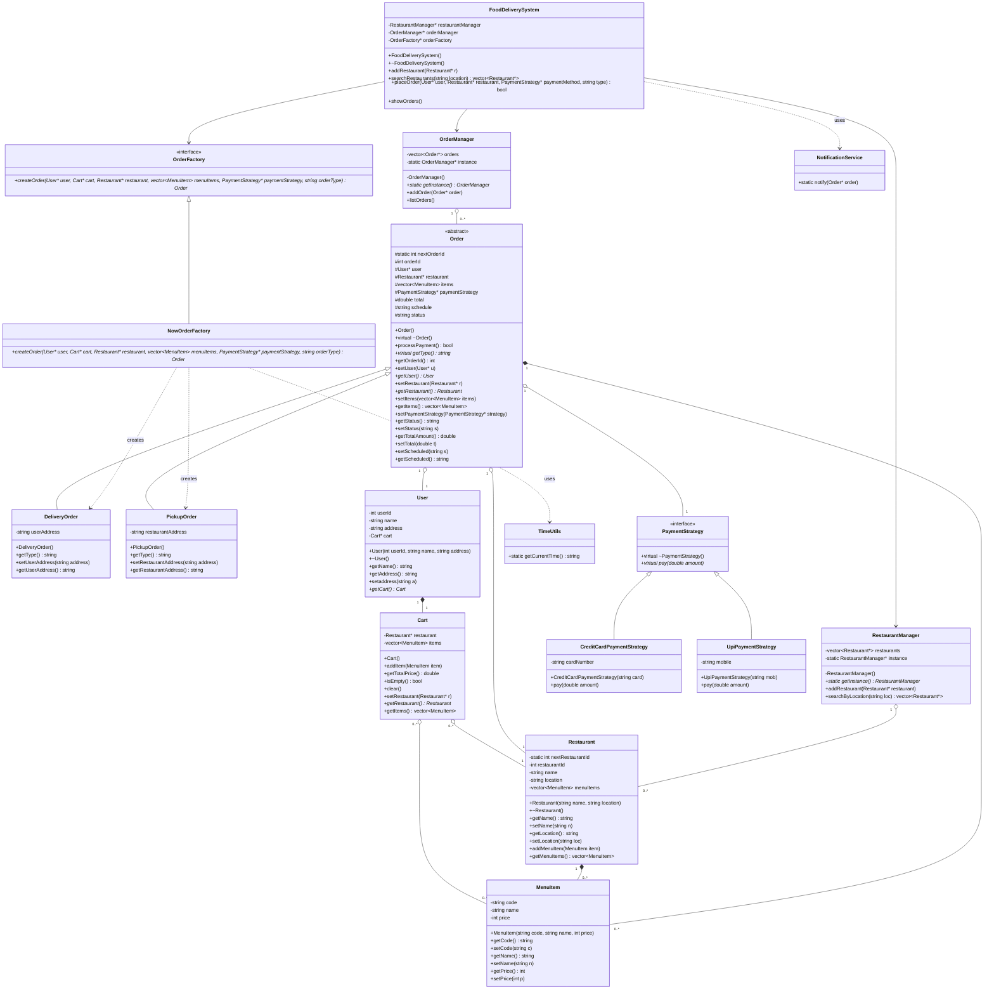

# 🏛️ Ultimate System Design & Design Patterns Guide (C++)

Welcome to the comprehensive reference guide for **Design Patterns** and **SOLID Principles**. This repository is designed to be a "one-stop shop" for learning how to build scalable, maintainable, and robust software systems using C++.

---

## 📑 Table of Contents
1. [🛠️ Getting Started](#-getting-started)
2. [🎯 SOLID Design Principles (Deep Dive)](#-solid-design-principles-deep-dive)
3. [🏗️ Creational Design Patterns](#-creational-design-patterns)
4. [🧱 Structural Design Patterns](#-structural-design-patterns)
5. [🔄 Behavioral Design Patterns](#-behavioral-design-patterns)
6. [🍔 Case Study: Food Delivery Application](#-case-study-food-delivery-application)

---

## 🛠️ Getting Started

### Prerequisites
- A C++ compiler (e.g., `g++`, `clang++`).
- Basic understanding of Object-Oriented Programming (Classes, Inheritance, Polymorphism).

### How to Run Examples
Each pattern is contained in a single standalone file for easy experimentation. To compile and run any pattern, use the following commands:

```bash
# Example: Running the Strategy Pattern
g++ strategyDesign.cpp -o strategy && ./strategy

# Example: Running the Builder Pattern
g++ builderDesign.cpp -o builder && ./builder
```

---

## 🎯 SOLID Design Principles (Deep Dive)

The SOLID principles are the foundation of clean architecture. Below are detailed breakdowns with "Bad" vs. "Good" implementation examples.

### 1. Single Responsibility Principle (SRP)
*   **Definition:** A class should have one, and only one, reason to change.
*   **The Problem:** "God Classes" that handle everything (logic, database, UI) are fragile and hard to test.
*   **Detailed Example:**
    *   ❌ **Bad:** A `User` class that handles both user data and saving that data to a database.
    *   ✅ **Good:** A `User` class for data and a `UserRepository` class for persistence.
```cpp
// Good Implementation (from solidPrinciple.cpp)
class Report {
public:
    string content;
    void generate() { content = "Data"; }
};

class ReportSaver {
public:
    void saveToFile(const Report& r, string file) { /* Logic */ }
};
```

### 2. Open/Closed Principle (OCP)
*   **Definition:** Software entities should be open for extension but closed for modification.
*   **The Problem:** Modifying existing code to add features often introduces bugs in previously working parts.
*   **Detailed Example:**
    *   ❌ **Bad:** Using a massive `switch` statement to calculate discounts for different customer types.
    *   ✅ **Good:** Using an abstract `DiscountStrategy` and creating subclasses for each type.

### 3. Liskov Substitution Principle (LSP)
*   **Definition:** Subclasses should be replaceable with their base classes without breaking the app.
*   **The Problem:** Inheritance that breaks expected behavior (e.g., a `Square` class inheriting from `Rectangle` and overriding `setWidth` to also change `setHeight`).
*   **Detailed Example:**
    *   ✅ **Good:** Extracting commonality into a more generic `Shape` interface instead of force-fitting inheritance.

### 4. Interface Segregation Principle (ISP)
*   **Definition:** Clients should not be forced to depend on methods they do not use.
*   **The Problem:** Massive interfaces that force subclasses to implement "dummy" or "empty" methods.
*   **Detailed Example:**
    *   ❌ **Bad:** A `Worker` interface with `work()` and `eat()` applied to a `Robot`.
    *   ✅ **Good:** Splitting into `IWorkable` and `IEatable`.

### 5. Dependency Inversion Principle (DIP)
*   **Definition:** Depend on abstractions, not on concrete implementations.
*   **The Problem:** High-level logic being hard-coded to specific low-level tools (like a specific database).
*   **Detailed Example:**
    *   ✅ **Good:** A `Button` class depending on a `Switchable` interface, rather than a specific `LightBulb` class.

---

## 🏗️ Creational Design Patterns

### 🏭 Factory Method
*   **Problem:** You don't know the exact types and dependencies of the objects your code should work with.
*   **Why use it?:** To decouple the client from the specific class instantiation.
*   **Implementation Snippet:**
```cpp
class Product { virtual void use() = 0; };
class ConcreteProduct : public Product { void use() override { /* ... */ } };

class Creator {
public:
    virtual unique_ptr<Product> create() = 0;
};
```
*   **Advantages:** SRP (product creation in one place), OCP (new types added easily).
*   **UML:** `Creator` -> `Product` (Interface) -> `ConcreteProduct`.

### 👷 Builder
*   **Problem:** Constructors with 10+ parameters ("Telescoping Constructor").
*   **Why use it?:** To construct complex objects step-by-step and keep the object's code clean.
*   **Key Detail:** In our `builderDesign.cpp`, we use method chaining (`setCpu()->setRam()`) to make construction readable.

---

## 🧱 Structural Design Patterns

### 🔌 Adapter
*   **Problem:** You have an existing class but its interface doesn't match the one you need.
*   **Why use it?:** To make two incompatible interfaces work together without changing their source code.
*   **Analogy:** A European plug adapter for a US laptop.

### 🧣 Decorator
*   **Problem:** You need to add responsibilities to objects at runtime without using a massive inheritance tree.
*   **Why use it?:** To "wrap" objects in layers of functionality (e.g., `MilkDecorator` wrapping `Coffee`).

### 🏛️ Facade
*   **Problem:** A system is too complex to use directly (requires 20 steps to initialize).
*   **Why use it?:** To provide a "Single Button" interface for a complex subsystem.

---

## 🔄 Behavioral Design Patterns

### 🏹 Strategy
*   **Problem:** You have multiple ways to perform an action (like sorting or payment) and you want to swap them easily.
*   **Why use it?:** To replace conditional statements with polymorphic behavior.
*   **Implementation Snippet (from strategyDesign.cpp):**
```cpp
class PaymentStrategy { public: virtual void pay(double amount) = 0; };
class CreditCard : public PaymentStrategy { /* implementation */ };

class ShoppingCart {
    unique_ptr<PaymentStrategy> method;
public:
    void setMethod(unique_ptr<PaymentStrategy> m) { method = move(m); }
};
```

### 📡 Observer
*   **Problem:** One object changes state and others need to know immediately.
*   **Why use it?:** To create a subscription model (like YouTube notifications) where the "Subject" doesn't need to know the details of the "Observers."

---

## 🍔 Case Study: Food Delivery Application

The `foodDelivery/` folder contains a miniature version of a real-world system.

### Core Architecture
- **Managers:** `OrderManager`, `RestaurantManager` (Singleton-like centralized control).
- **Models:** `User`, `Restaurant`, `MenuItem`, `Cart`.
- **Patterns Integrated:**
    - **Strategy:** `PaymentStrategy` for Credit Card and UPI payments.
    - **Factory:** `OrderFactory` to distinguish between "Now" and "Scheduled" orders.
    - **Models:** Heavy use of inheritance for `DeliveryOrder` vs `PickupOrder`.

### File Map
- `main.cpp`: Entry point for the application simulation.
- `models/`: Plain Data Objects.
- `strategies/`: Interchangeable algorithms for payment.
- `factories/`: Logic for object creation.

### Detailed System UML Diagram



---

## 📄 License
This project is for educational purposes. Feel free to use the code for learning or as a base for your own projects.
